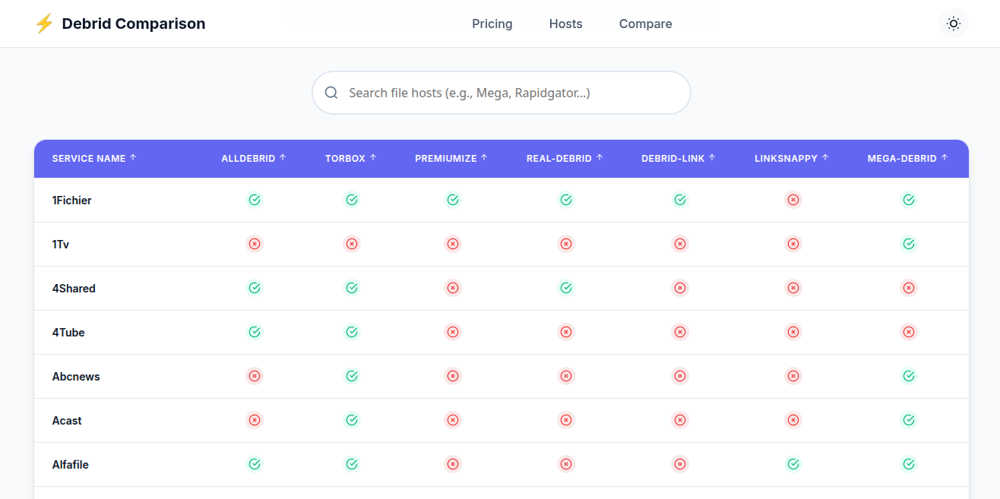

# Debrid Services Comparison

A comprehensive comparison of pricing and supported hosts for popular debrid services including [AllDebrid](https://alldebrid.com/), [Real-Debrid](https://real-debrid.com/), [LinkSnappy](https://linksnappy.com/myaccount/status), [Premiumize](https://www.premiumize.me/services), [Debrid-Link](https://debrid-link.com/), [TorBox](https://torbox.app/), and [Mega-Debrid](https://debrid-link.com).

<a href="https://debrid-services-comparison.netlify.app/">

<em>Interactive comparison tool with real-time filtering</em>

</a>

## Quick Start

**New to debrid services?** These services act as premium download accelerators, allowing you to:

- ⚡ Download files at maximum speed without waiting
- 🔗 Access premium file hosting sites without individual subscriptions
- 🌐 Stream content directly from supported hosts
- 💾 Convert torrent links to direct downloads

## 📋 Contents

- [Getting Started](#getting-started)
- [Pricing Comparison](#pricing-comparison)
  - [Price Overview](#detailed-pricing)
  - [Up-to-date Pricing](#up-to-date-pricing)
  - [Refund Policies](#refund-policies)
- [Supported Hosts](#-supported-hosts)
  - [File Hosts](#file-hosts)
  - [Adult Hosts](#adult-hosts)
  - [Live Status](#live-status)
- [Speed Test](#speed-test)
- [Frequently Asked Questions](#-frequently-asked-questions)
- [Important Notes](#important-notes)
- [Useful Resources](#-useful-resources)

## Getting Started

### Support This Project

**Found this comparison helpful?**

Consider using our referral links when signing up - it helps maintain this project at no extra cost to you! 🙏

| Service         | Referral Link                                                                                            | Direct Link                                                             |
| :-------------- | :------------------------------------------------------------------------------------------------------- | :---------------------------------------------------------------------- |
| **AllDebrid**   | [🎁 Sign up with referral](https://alldebrid.com/?uid=3wvya&lang=en)                                      | [Direct signup](https://alldebrid.com/register/)                        |
| **Real-Debrid** | [🎁 Sign up with referral](http://real-debrid.com/?id=10990901)                                           | [Direct signup](http://real-debrid.com/)                                |
| **TorBox**      | [🎁 Sign up with referral](https://torbox.app/subscription?referral=47eece72-46b8-483b-8b7a-79d6c16dedf2) | [Direct signup](https://torbox.app/login)                               |
| **Premiumize**  | ❌                                                                                                        | [Direct signup](https://www.premiumize.me/register)                     |
| **LinkSnappy**  | [🎁 Sign up with referral](http://linksnappy.com/?ref=774668)                                             | [Direct signup](https://linksnappy.com/home#Register)                   |
| **Debrid-Link** | [🎁 Sign up with referral](https://debrid-link.com/id/7B3BO)                                              | [Direct signup](https://debrid-link.com/webapp/register)                |
| **Mega-Debrid** | ❌                                                                                                        | [Direct signup](https://www.mega-debrid.eu/index.php?page=freeregister) |
| **DeepBird**    | [🎁 Sign up with referral](https://www.deepbrid.com/aff/go/upward1971)                                    | [Direct signup](https://www.deepbrid.com/signup)                        |

---

## Pricing Comparison

> **💡 Pro Tip:** Longer subscriptions typically offer better value per month. Compare the effective monthly rates below!

### Detailed Pricing

| Plan Duration  | AllDebrid     | Premiumize | Real-Debrid | TorBox      | Debrid-Link | LinkSnappy | Mega-Debrid | Deepbird      |
| :------------- | :------------ | :--------- | :---------- | :---------- | :---------- | :--------- | :---------- | :------------ |
| **Free/Trial** | 7 days¹       | ❌          | ❌           | Free tier²  | ❌           | ❌          | ❌           | Limited Hosts |
| **7 Days**     | ❌             | ❌          | ❌           | ❌           | ❌           | $4.99      | ❌           | ❌             |
| **15 Days**    | €2.99⁴        | ❌          | €3.00       | ❌           | €3.00       | ❌          | ❌           | €4.50         |
| **30 Days**    | €2.99³/€3.99⁴ | $11.99     | €4.00       | From $3.00⁵ | €4.00       | $12.99     | €4.00       | €4.99         |
| **90 Days**    | €8.99⁴        | $29.99     | €9.00       | ❌           | €9.00       | $29.99     | €9.00       | €12.99        |
| **180 Days**   | €15.99⁴       | ❌          | €16.00      | ❌           | €16.00      | $54.99     | €16.00      | €19.99        |
| **300 Days**   | €24.99⁴       | ❌          | ❌           | ❌           | €25.00      | ❌          | ❌           | ❌             |
| **365 Days**   | ❌             | $79.99     | ❌           | ❌           | ❌           | ❌          | ❌           | €32.99        |

**📝 Pricing Notes**
- **¹** AllDebrid: 7-day free trial requires phone verification
- **²** TorBox: Has a free tier with limited features
- **³** AllDebrid: For recurring subscription
- **⁴** AllDebrid: For one-time monthly payment
- **⁵** TorBox: Multiple pricing tiers available starting from $3.00/month

---

### Up-to-date Pricing

**⚡ Always verify current pricing before purchasing!** Prices change frequently.

- **AllDebrid** - [Official Pricing ↗](https://alldebrid.com/offer/)
- **Real-Debrid** - [Official Pricing ↗](https://real-debrid.com/premium)
- **TorBox**      - [Official Pricing ↗](https://torbox.app/pricing)
- **Premiumize**  - [Official Pricing ↗](https://www.premiumize.me/premium)
- **LinkSnappy**  - [Official Pricing ↗](https://linksnappy.com/myaccount/extend)
- **Debrid-Link** - [Official Pricing ↗](https://debrid-link.com/premium)
- **Mega-Debrid** - [Official Pricing ↗](https://www.mega-debrid.eu/index.php?page=offres)
- **DeepBird**    - [Official Pricing ↗](https://www.deepbrid.com/signup)

_Last Pricing Update:_ `June 26, 2025`

### Refund Policies

> **💡 Important:** Always review the most current refund policy on each service's official website before purchasing, as policies may change.

| Service         | Refund Policy                                                                                            | Terms/Refund Policy Link                                                     |
| :-------------- | :------------------------------------------------------------------------------------------------------- | :--------------------------------------------------------------------------- |
| **AllDebrid**   | Check Terms of Service for refund conditions                                                            | [Terms of Service](https://alldebrid.com/tos/)                              |
| **Real-Debrid** | Refund up to 14 days if account unused (check traffic page first)                                       | [Terms of Service](https://real-debrid.com/terms)                           |
| **TorBox**      | See terms for refund conditions                                                                          | [Terms & Refunds](https://torbox.app/terms#refunds)                         |
| **Premiumize**  | Check legal page for refund policy                                                                       | [Legal & Refund Policy](https://www.premiumize.me/legal#refund)             |
| **LinkSnappy**  | Dedicated refund policy available                                                                        | [Refund Policy](https://linksnappy.com/refund-policy)                       |
| **Debrid-Link** | See Terms of Service for refund conditions                                                               | [Terms of Service](https://debrid-link.com/tos)                             |
| **Mega-Debrid** | No standard refund policy                                                                                | Contact customer support for specific issues                                |
| **DeepBird**    | Dedicated refund policy page                                                                             | [Refund Policy](https://www.deepbrid.com/page/refund-policy)                |

**🔍 Refund Tips:**
- Always read the complete terms before purchasing
- For Real-Debrid: Check your [traffic page](https://real-debrid.com/traffic) before requesting refund
- Start with shorter duration plans to test service compatibility
- Keep records of your purchase and any issues encountered
- Contact customer support promptly if you experience problems

## Available Hosts

### File Hosts
| **Service Name** | **AllDebrid** | **TorBox** | **Premiumize** | **Real-Debrid** | **Debrid-Link** | **LinkSnappy** | **Mega-Debrid** | **DeepBird** |
| :--- | :--- | :--- | :--- | :--- | :--- | :--- | :--- | :--- |
| **1Fichier** | Yes | Yes | Yes | Yes | Yes | No | Yes | Yes |
| **1Tv** | No | No | No | No | No | No | Yes | No |
| **4Shared** | Yes | Yes | No | Yes | No | No | No | Yes |
| **4Tube** | Yes | Yes | No | No | No | No | No | No |
| **Abcnews** | No | Yes | No | No | No | No | Yes | No |
| **Acast** | No | Yes | No | No | No | No | Yes | No |
| **Alfafile** | Yes | Yes | No | No | No | Yes | Yes | Yes |
| **Annas archive** | No | Yes | No | No | No | No | No | No |
| **Anonfiles** | No | No | No | No | No | No | Yes | No |
| **Aparat** | No | Yes | No | No | No | No | Yes | No |
| **Apkadmin** | Yes | Yes | No | No | No | No | No | No |
| **Archive.org** | Yes | Yes | Yes | No | No | No | Yes | No |
| **Audioboom** | No | Yes | No | No | No | No | Yes | No |
| **Audiomack** | No | Yes | No | No | No | No | Yes | No |
| **Baidu video** | No | Yes | No | No | No | No | No | No |
| **Baidu** | No | No | No | No | No | No | No | No |
| **Bayfiles** | No | No | No | No | No | No | No | Yes |
| **Bbc** | No | Yes | No | No | No | No | No | No |
| **Bilibili** | No | Yes | No | No | No | No | No | No |
| **Bluesky** | No | Yes | No | No | No | No | No | No |
| **Buenastareas** | No | No | No | No | No | No | No | Yes |
| **Bunkr** | No | Yes | No | No | No | No | No | No |
| **Buzzheavier** | No | Yes | No | No | No | No | No | No |
| **Calameo** | No | No | No | No | No | No | Yes | Yes |
| **Camdemy** | No | Yes | No | No | No | No | Yes | No |
| **Canalplus** | Yes | Yes | No | No | No | No | No | No |
| **Cc.com** | No | No | No | No | No | No | Yes | No |
| **Chilloutzone** | No | Yes | No | No | No | No | Yes | No |
| **Cinemassacre** | No | No | No | No | No | No | Yes | No |
| **Clicknupload** | No | Yes | Yes | Yes | Yes | Yes | Yes | Yes |
| **Clipfish** | No | No | No | No | No | No | Yes | No |
| **Clipsyndicate** | No | No | No | No | No | No | Yes | No |
| **Cloudvideo** | Yes | No | Yes | No | No | Yes | No | No |
| **Clubic** | No | No | No | No | No | No | Yes | No |
| **Collegehumor** | No | No | No | No | No | No | Yes | No |
| **Comedy central** | No | Yes | No | No | No | No | No | No |
| **Comedycentral** | Yes | No | No | No | No | No | No | No |
| **Crunchyroll** | Yes | No | No | No | No | No | No | No |
| **Daclips** | No | No | No | No | No | No | Yes | No |
| **Dagbladet** | No | No | No | No | No | No | Yes | No |
| **Dailymail** | No | Yes | No | No | No | No | Yes | No |
| **Dailymotion** | Yes | Yes | No | Yes | No | Yes | No | Yes |
| **Dailyuploads** | Yes | Yes | No | Yes | Yes | No | Yes | Yes |
| **Darikibox** | No | No | No | No | Yes | No | No | No |
| **Data nodes** | No | Yes | No | No | No | No | No | No |
| **Datafilehost** | No | No | No | No | No | No | Yes | No |
| **Dctp** | No | Yes | No | No | No | No | Yes | No |
| **Ddowload / ddl.to** | No | No | No | No | Yes | Yes | Yes | No |
| **Ddownload** | Yes | Yes | No | Yes | No | No | No | Yes |
| **Ddownload10** | No | No | No | No | No | No | No | No |
| **Depositfiles** | No | No | No | No | No | No | No | Yes |
| **Discovery channel** | No | No | No | No | No | No | Yes | No |
| **Dotsub** | No | No | No | No | No | No | Yes | No |
| **Drop.download / dropapk** | No | No | Yes | No | Yes | No | No | No |
| **Drop.download** | No | No | No | Yes | No | No | Yes | No |
| **Drop** | No | No | No | No | No | No | No | Yes |
| **Dropapk** | Yes | Yes | No | No | No | No | No | Yes |
| **Dropbox** | No | Yes | No | Yes | Yes | No | No | No |
| **Dropgalaxy** | Yes | No | No | No | No | No | No | No |
| **Dropmefiles** | No | No | No | No | No | No | Yes | No |
| **Easybytez** | No | No | No | No | No | No | No | Yes |
| **Ebaumsworld** | No | Yes | No | No | No | No | Yes | No |
| **Elitefile** | No | No | No | No | Yes | No | No | No |
| **Ellentv** | No | No | No | No | No | No | Yes | No |
| **Emload** | No | No | No | No | Yes | No | No | Yes |
| **Exload** | Yes | No | No | No | No | No | No | No |
| **Extmatrix** | No | No | No | No | No | No | No | Yes |
| **Facebook** | No | Yes | No | No | No | No | No | No |
| **Fastbit** | Yes | No | No | No | No | No | No | No |
| **Fastfile** | No | No | No | No | No | No | No | Yes |
| **Fikper** | No | No | No | Yes | Yes | No | Yes | Yes |
| **File.al** | Yes | No | Yes | Yes | No | Yes | No | No |
| **File** | No | No | No | No | No | No | No | Yes |
| **File4safe** | No | No | No | No | No | No | No | Yes |
| **Fileaxa** | No | No | No | No | Yes | No | No | Yes |
| **Fileblade** | No | No | No | No | No | No | No | Yes |
| **Filecat** | No | No | No | No | Yes | No | No | Yes |
| **Filedot** | Yes | No | No | No | Yes | No | No | No |
| **Filefactory** | No | No | Yes | Yes | No | Yes | Yes | Yes |
| **Fileland** | No | No | No | No | Yes | No | No | No |
| **Filenext** | No | No | Yes | Yes | No | Yes | No | Yes |
| **Filer.net** | No | Yes | No | No | No | No | Yes | No |
| **Filer** | No | No | No | No | No | No | No | Yes |
| **Filerio** | Yes | No | No | No | No | No | No | No |
| **Filesfly** | No | No | No | No | Yes | No | No | No |
| **Filesmonster** | No | No | No | No | No | No | No | Yes |
| **Filespace** | Yes | No | No | Yes | No | Yes | No | Yes |
| **Filestank** | No | No | No | No | No | No | Yes | No |
| **Filestore.me** | No | Yes | No | No | No | No | No | No |
| **Filestore.to** | No | No | Yes | Yes | Yes | No | No | No |
| **Filestore** | No | No | No | No | No | No | No | Yes |
| **Filextras** | No | No | No | Yes | No | No | No | Yes |
| **Filezip** | Yes | No | No | No | No | No | No | No |
| **Fireget** | No | No | No | No | No | No | No | Yes |
| **Flashbit** | Yes | No | No | Yes | No | No | Yes | No |
| **Flipagram** | No | No | No | No | No | No | Yes | No |
| **Flix555** | No | No | No | No | No | No | Yes | No |
| **Formula1** | No | Yes | No | No | No | No | Yes | No |
| **Foxnews** | No | Yes | No | No | No | No | Yes | No |
| **Free** | No | No | No | No | No | No | Yes | Yes |
| **Fuckingfast** | No | Yes | No | No | No | No | No | No |
| **Gamersyde** | No | No | No | No | No | No | Yes | No |
| **Gamestar** | No | Yes | No | No | No | No | Yes | No |
| **Gigapeta** | Yes | No | No | Yes | No | Yes | No | Yes |
| **Github** | No | Yes | No | No | No | No | No | No |
| **Gofile** | No | Yes | No | No | No | No | No | No |
| **Google drive** | No | Yes | No | Yes | No | No | No | No |
| **Google** | Yes | No | Yes | No | No | No | No | No |
| **Harefile** | No | No | No | No | No | No | No | No |
| **Hexload** | No | No | No | No | No | No | No | Yes |
| **Hexupload / hexload** | Yes | Yes | Yes | Yes | No | No | No | No |
| **Hitfile** | Yes | Yes | Yes | Yes | No | Yes | Yes | Yes |
| **Hot4share** | Yes | No | No | No | No | No | No | Yes |
| **Hotlink** | No | No | No | No | No | No | Yes | Yes |
| **Hulkshare** | No | No | No | No | Yes | No | No | Yes |
| **Icerbox*** | No | No | No | No | No | No | No | Yes |
| **Icloud drive** | No | No | No | Yes | No | No | No | No |
| **Idnes** | No | Yes | No | No | No | No | Yes | No |
| **Imgur** | No | Yes | No | No | No | No | No | No |
| **Indishare** | Yes | No | No | No | No | No | No | No |
| **Instagram** | No | Yes | No | No | No | No | Yes | No |
| **Isra.cloud** | No | No | No | Yes | Yes | No | Yes | No |
| **Isra** | Yes | No | Yes | No | No | Yes | No | No |
| **Issuu** | No | No | No | No | No | No | Yes | Yes |
| **Izlesene** | No | Yes | No | No | No | No | Yes | No |
| **Jamendo** | No | Yes | No | No | No | No | Yes | No |
| **Jumploads** | No | No | No | No | Yes | No | No | Yes |
| **K2s*** | No | No | No | No | No | No | No | Yes |
| **Karrierevideos** | No | No | No | No | No | No | Yes | No |
| **Katfile** | Yes | Yes | Yes | Yes | Yes | Yes | Yes | Yes |
| **Keek** | No | No | No | No | No | No | Yes | No |
| **Kenfiles** | No | No | No | No | No | No | No | Yes |
| **Khanacademy** | No | Yes | No | No | No | No | Yes | No |
| **Kick** | No | Yes | No | No | No | No | No | No |
| **Kickstarter** | No | Yes | No | No | No | No | Yes | No |
| **Krakenfiles** | No | Yes | No | No | No | No | No | Yes |
| **Kshared** | No | No | No | No | Yes | No | No | No |
| **Kvid** | No | No | No | No | No | No | Yes | No |
| **Lcp** | No | Yes | No | No | No | No | Yes | No |
| **Loom** | No | Yes | No | No | No | No | No | No |
| **Lynda** | Yes | No | No | No | No | No | No | No |
| **Mediaccc** | No | No | No | No | No | No | Yes | No |
| **Mediafire** | Yes | Yes | Yes | Yes | Yes | Yes | Yes | Yes |
| **Mega** | Yes | Yes | Yes | Yes | Yes | Yes | Yes | Yes |
| **Megaup** | No | Yes | No | No | No | No | No | No |
| **Metacafe** | No | No | No | No | No | No | Yes | No |
| **Mexashare** | Yes | No | No | No | Yes | No | No | Yes |
| **Mixcloud** | No | No | No | No | No | No | Yes | No |
| **Mixdrop** | Yes | Yes | No | No | Yes | No | No | No |
| **Modsbase** | Yes | No | Yes | No | No | No | No | No |
| **Movieclips** | No | No | No | No | No | No | Yes | No |
| **Movpod** | No | No | No | No | No | No | Yes | No |
| **Mp4upload** | Yes | No | No | No | No | No | No | No |
| **Msnbc** | No | No | No | No | No | No | Yes | No |
| **Myspass** | No | No | No | No | No | No | Yes | No |
| **Nbcsports** | No | Yes | No | No | No | No | Yes | No |
| **Ndtv** | No | No | No | No | No | No | Yes | No |
| **Nelion** | No | No | No | No | Yes | No | No | No |
| **Nexusmods** | No | Yes | No | No | No | No | No | No |
| **Nfl** | No | Yes | No | No | No | No | Yes | No |
| **Niconico** | Yes | Yes | No | No | No | No | No | No |
| **Nitroflare** | No | Yes | No | No | No | No | No | Yes |
| **Nytimes** | Yes | Yes | Yes | No | No | No | No | No |
| **Oboom** | No | No | No | No | No | No | No | Yes |
| **Odatv** | No | No | No | No | No | No | Yes | No |
| **Odnoklassniki** | Yes | Yes | No | No | No | No | No | No |
| **Ok.ru** | No | No | No | No | No | No | Yes | No |
| **Onionstudios** | No | No | No | No | No | No | Yes | No |
| **Pan baidu** | No | Yes | No | No | No | No | No | No |
| **Panopto** | No | Yes | No | No | No | No | No | No |
| **Paramount+** | No | No | No | No | No | No | No | No |
| **Pillowcase** | No | Yes | No | No | No | No | No | No |
| **Pinkbike** | No | No | No | No | No | No | Yes | No |
| **Pinterest** | No | Yes | No | No | No | No | No | No |
| **Piwi+** | No | No | No | No | No | No | Yes | No |
| **Pixeldrain** | No | Yes | No | No | Yes | No | Yes | No |
| **Plays** | No | No | No | No | No | No | Yes | No |
| **Playtvak** | No | No | No | No | No | No | Yes | No |
| **Prefiles** | Yes | No | No | Yes | Yes | No | No | Yes |
| **Pyvideo** | No | No | No | No | No | No | Yes | No |
| **Qiwi** | No | Yes | No | No | No | No | No | No |
| **Radiotunes** | No | No | No | Yes | No | No | No | Yes |
| **Rapidfileshare** | Yes | No | No | No | No | No | No | No |
| **Rapidgator** | Yes | Yes | Yes | Yes | Yes | Yes | Yes | Yes |
| **Rapidrar** | No | Yes | No | No | No | No | No | Yes |
| **Reddit** | No | Yes | No | No | No | No | No | No |
| **Revision3** | No | No | No | No | No | No | Yes | No |
| **Rosefile** | No | No | No | No | No | No | No | Yes |
| **Rtbf** | Yes | No | No | No | No | No | No | No |
| **Rte** | No | No | No | No | No | No | Yes | No |
| **Rts** | Yes | No | No | No | No | No | No | No |
| **Rtve.es** | Yes | Yes | Yes | No | No | No | No | No |
| **Ruhd** | No | No | No | No | No | No | Yes | No |
| **Rutube** | Yes | Yes | No | No | No | No | No | Yes |
| **Ruutu** | No | No | No | No | No | No | Yes | No |
| **Salefiles** | No | No | No | No | No | No | No | Yes |
| **Scribd** | Yes | Yes | No | Yes | Yes | No | No | Yes |
| **Send.cm** | No | No | No | Yes | No | No | Yes | No |
| **Send.now** | No | Yes | No | No | No | No | No | No |
| **Sendit** | Yes | No | No | No | No | No | No | No |
| **Sendspace** | No | Yes | No | Yes | No | No | No | Yes |
| **Sharemods** | Yes | No | No | No | No | No | No | No |
| **Silkfiles** | No | No | No | No | Yes | No | No | No |
| **Simfileshare** | Yes | No | No | No | No | No | Yes | No |
| **Slideshare** | No | No | No | No | No | No | No | Yes |
| **Smotri** | No | No | No | No | No | No | Yes | No |
| **Snapchat** | No | Yes | No | No | No | No | No | No |
| **Snotr** | No | No | No | No | No | No | Yes | No |
| **Solidfiles** | No | No | No | No | No | No | No | Yes |
| **Soundcloud** | Yes | Yes | Yes | No | Yes | Yes | No | Yes |
| **Sportdeutschland** | No | No | No | No | No | No | Yes | No |
| **Steam (video)** | No | Yes | No | No | No | No | No | No |
| **Steam** | No | No | No | No | No | No | Yes | No |
| **Stream.cz** | No | No | No | No | No | No | Yes | No |
| **Streamable** | No | Yes | No | No | No | No | Yes | No |
| **Streamers** | No | No | No | No | No | No | Yes | No |
| **Streamtape** | No | Yes | Yes | No | No | No | Yes | No |
| **Subyshare** | No | No | No | No | Yes | No | No | Yes |
| **Swisstransfer** | No | Yes | No | No | No | No | No | No |
| **Syncs** | No | No | No | No | No | No | No | Yes |
| **Sztv** | No | No | No | No | No | No | Yes | No |
| **Takefile** | No | No | No | No | No | No | No | Yes |
| **Teachingchannel** | No | No | No | No | No | No | Yes | No |
| **Teamfourstar** | No | No | No | No | No | No | Yes | No |
| **Techtalks** | No | No | No | No | No | No | Yes | No |
| **Ted** | No | No | No | No | No | No | Yes | No |
| **Telebruxelles** | No | No | No | No | No | No | Yes | No |
| **Terabox** | No | Yes | No | No | Yes | No | No | Yes |
| **Terabytez** | No | Yes | No | Yes | Yes | No | No | Yes |
| **Tezfiles** | No | No | No | No | Yes | No | No | No |
| **Tiktok** | No | Yes | No | No | No | No | No | No |
| **Tlc** | No | Yes | No | No | No | No | No | No |
| **Trashbytes** | No | Yes | No | No | No | No | No | No |
| **Tumblr** | No | Yes | No | No | No | No | No | No |
| **Turbobit** | Yes | Yes | Yes | Yes | Yes | Yes | Yes | Yes |
| **Tusfiles** | No | No | No | No | No | No | No | Yes |
| **Tweakers** | No | No | No | No | No | No | Yes | No |
| **Twitch** | Yes | Yes | No | No | No | No | No | No |
| **Twitter** | No | Yes | No | No | No | No | No | No |
| **Upload42** | Yes | No | No | No | No | No | No | No |
| **Uploadbank** | Yes | No | No | No | No | No | No | No |
| **Uploadbox** | Yes | No | No | No | No | No | No | No |
| **Uploadboy** | Yes | No | Yes | No | No | No | No | Yes |
| **Uploadev** | Yes | No | No | No | No | No | No | No |
| **Uploadgig** | No | No | No | No | No | No | No | Yes |
| **Uploadhaven** | No | No | No | No | No | No | No | Yes |
| **Uploadrar** | Yes | No | Yes | No | No | No | No | No |
| **Uploady** | Yes | No | No | Yes | Yes | No | Yes | No |
| **Upstream** | No | No | No | No | No | No | No | No |
| **Uptobox** | No | No | No | No | No | No | No | Yes |
| **Upvid** | No | No | No | No | Yes | No | No | No |
| **Uqload** | No | No | No | No | Yes | No | No | No |
| **Userscloud** | Yes | No | No | No | No | No | No | Yes |
| **Usersdrive** | Yes | No | Yes | Yes | Yes | No | No | No |
| **Userupload** | Yes | No | No | No | No | No | No | No |
| **Ustream** | No | No | No | No | No | No | Yes | No |
| **Veoh** | No | No | Yes | No | No | No | No | No |
| **Verystream** | No | No | No | No | No | No | Yes | No |
| **Vev** | No | No | No | No | No | No | Yes | No |
| **Vidabc** | No | No | No | No | No | No | Yes | No |
| **Vidoza** | Yes | No | Yes | No | Yes | No | Yes | Yes |
| **Vidspot** | No | No | No | No | No | No | Yes | No |
| **Vidto** | No | No | No | No | No | No | Yes | No |
| **Vidzi** | No | No | No | No | No | No | Yes | No |
| **Vimeo** | Yes | Yes | No | Yes | No | No | No | Yes |
| **Vipfile** | Yes | No | No | No | No | No | No | No |
| **Vk** | No | Yes | Yes | No | No | No | No | No |
| **Voe** | No | No | No | Yes | No | No | No | No |
| **Vup** | No | No | No | No | No | No | Yes | No |
| **Wayupload** | Yes | No | No | No | No | No | No | No |
| **Webshare** | No | Yes | No | No | No | No | No | No |
| **Wipfiles** | No | No | No | Yes | No | No | No | No |
| **Workupload** | No | No | No | No | Yes | No | No | No |
| **Worldbytez** | Yes | Yes | No | Yes | Yes | No | Yes | Yes |
| **Wupfile / salefiles** | No | No | Yes | Yes | Yes | Yes | Yes | No |
| **Wushare** | No | No | No | No | No | No | No | Yes |
| **Xiaohongshu** | No | Yes | No | No | No | No | No | No |
| **Xubster** | No | No | No | No | No | No | No | Yes |
| **Xvidstage** | No | No | No | No | No | No | Yes | No |
| **Yandex disk** | No | Yes | No | No | No | No | No | No |
| **Yandex video** | No | Yes | No | No | No | No | No | No |
| **Youku** | No | No | No | No | No | No | Yes | No |
| **Youtube** | No | Yes | Yes | No | No | No | No | Yes |
| **Total** = `283` | `70/283` | `104/283` | `31/283` | `40/283` | `45/283` | `19/283` | `118/283` | `80/283` |

**Last Updated: `June 26, 2025`**

### Adult Hosts

- You can have a look at adult hosts of all providers in: [Adult-hosts.md](./Adult-hosts.md)

### Live status

**🚨 For real-time information on host availability and service status, always refer to official status pages.** These provide the most accurate and up-to-date details on maintenance and issues.

- [AllDebrid](https://alldebrid.com/status/)
- [Real-Debrid](https://real-debrid.com/compare)
- [LinkSnappy](https://linksnappy.com/myaccount/status)
- [Premiumize](https://www.premiumize.me/services)
- [TorBox](https://torbox.app/hosters)
- [Debrid-Link](https://debrid-link.com/webapp/status)
- [Mega-Debrid](https://www.mega-debrid.eu/index.php?page=hebergeurs)
- [DeepBird](https://www.deepbrid.com/status)

## Speed Test

> **🚀 Test before you buy!** Test actual download speeds across different debrid services.

**Not all sites provide official speed testing page, the ones that have speed testing pages are as follows:**

### Official Speed Test Pages:
- [real-debrid](https://real-debrid.com/speedtest)
- [TorBox](https://www.torbox.app/speedtest)
- [Premiumize](https://www.premiumize.me/speedtest)
- [Debrid-Link](https://debrid-link.com/webapp/speedtest)
- [Mega-Debid](https://www.mega-debrid.eu/index.php?page=network)

### DIY Speed Testing

**📋 Manual Testing Steps:**

1. **Prepare Test Files**: Use the same file from multiple hosts (e.g., a popular Linux distro)
2. **Test Conditions**: 
   - Same time of day for consistency
   - Same network connection
   - Clear browser cache between tests
3. **Record Results**: Note download speeds, start times, and any interruptions
4. **Multiple Tests**: Run at least 3 tests per service for average speeds

### Performance Factors

**⚠️ Factors Affecting Speed:**
- **Time of Day**: Peak hours may show slower speeds
- **Geographic Location**: Distance from servers affects latency
- **ISP Throttling**: Some providers may limit certain traffic
- **File Host Performance**: Individual host server load varies
- **Service Load**: Popular services may experience congestion

**💡 Pro Tips:**
- Test during different times of day
- Compare speeds with direct downloads when possible
- Consider your typical usage patterns when evaluating results
- Factor in reliability alongside pure speed

## ❓ Frequently Asked Questions

### General Questions

**Q: What exactly is a debrid service?**
A: Debrid services act as intermediaries that provide premium access to file hosting sites. They download files to their servers first, then provide you with high-speed direct downloads without ads, waiting times, or speed limitations.

**Q: Are debrid services legal?**
A: Yes, debrid services themselves are legal. They provide legitimate access to file hosting platforms. However, users are responsible for ensuring they only download content they have legal rights to access.

**Q: Can I use multiple debrid services simultaneously?**
A: Yes, many users subscribe to multiple services for maximum host coverage and redundancy. Some applications even support automatic failover between services.

**Q: Do I need a VPN with debrid services?**
A: While not required, a VPN is recommended for additional privacy and may help with geographic restrictions. Some users report better performance when using VPNs with certain services.

### Technical Questions

**Q: Why do download speeds vary between services?**
A: Speed differences depend on:
- Server locations and your geographic proximity
- Time of day and server load
- Your ISP's routing and peering agreements
- Individual file host performance
- Service infrastructure capacity

**Q: What happens if a file host goes down?**
A: If a host is temporarily unavailable, you'll need to wait for it to come back online or find the same file on a different supported host. This is why services with more supported hosts offer better reliability.

**Q: Can I download torrents with debrid services?**
A: Most debrid services support torrent-to-direct-download conversion. They download the torrent to their servers and provide you with direct download links for the files.

**Q: Are there download limits?**
A: Most services offer unlimited downloads, but some may have fair usage policies or throttle speeds after heavy usage. Check each service's terms for specific limitations.

### Service-Specific Questions

**Q: Can I share my debrid account?**
A: Account sharing policies vary:
- Most services prohibit account sharing in their terms
- Some offer family plans or multiple connections
- IP restrictions may limit simultaneous usage
- Violation can result in account suspension

**Q: What payment methods are accepted?**
A: Common payment options include:
- Credit/debit cards (most services)
- PayPal (most services)
- Cryptocurrency (AllDebrid, TorBox, Debrid-Link, DeepBird)
- Bank transfers (some European services)
- Gift cards (limited services)

### Troubleshooting

**Q: My downloads are slower than expected. What can I do?**
A: Try these solutions:
1. Test at different times of day
2. Try different file hosts for the same content
3. Check your internet connection speed
4. Disable VPN temporarily to test
5. Contact customer support with specific examples

**Q: A file host shows as supported but doesn't work. Why?**
A: Possible reasons:
- Temporary host maintenance or issues
- File was removed from the original host
- Host changed their API (waiting for service update)
- Geographic restrictions on the file
- File requires premium host account renewal

**Q: Can I get a refund if I'm not satisfied?**
A: Refund policies vary by service (see [Refund Policies](#refund-policies) section above). Generally:
- Some services offer 7-14 day money-back guarantees
- Others have no refund policies
- Start with shorter subscriptions to test compatibility

**Q: How do I maximize my debrid service usage?**
A: Best practices:
- Use browser extensions for automatic link detection
- Set up applications like JDownloader with debrid integration
- Keep multiple backup links for important files
- Monitor service status pages for maintenance notifications
- Take advantage of longer subscription discounts if satisfied

### Security & Privacy

**Q: Do debrid services log my downloads?**
A: Logging policies vary (see [Security & Privacy Analysis](#-security--privacy-analysis)):
- Some services maintain minimal logs for technical purposes
- Others claim no-logging policies
- EU-based services must comply with GDPR
- Check each service's privacy policy for specifics

**Q: Is my payment information secure?**
A: Reputable debrid services use:
- Secure payment processors
- SSL/TLS encryption for transactions
- PCI DSS compliance for card processing
- Cryptocurrency options for additional privacy

**Q: Can my ISP see what I'm downloading?**
A: ISPs can see:
- That you're connecting to debrid service servers
- The amount of data transferred
- They cannot see specific file names or content when using HTTPS
- Using a VPN adds an additional layer of privacy

## Important Notes

#### 🔄 **Pricing and Availability**

- Pricing plans and supported hosts are subject to change by service providers **without notice**
- Always verify current information on official websites before purchasing
- Currency exchange rates may affect actual costs

#### 🛡️ **No Guarantees**

- This comparison is for **informational purposes only**
- We do not guarantee uptime, performance, or availability of any service or host
- Use services at your own discretion and risk

#### 💰 **Referral Transparency**

- Referral links in the "Getting Started" section help support this project.
- Direct links are always provided as alternatives

#### 🔍 **Do Your Research**

- Read reviews and explore features before choosing a service
- Consider your specific use case and requirements
- Test free trials when available

## 📚 Useful Resources & Community

### 🌟 **Essential Links**

- **[Awesome-Debrid](https://github.com/debridmediamanager/awesome-debrid)** - Comprehensive debrid resources
