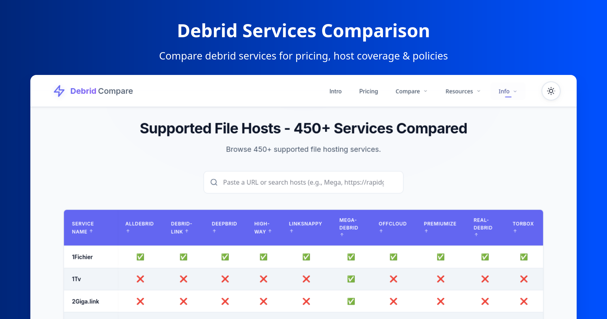
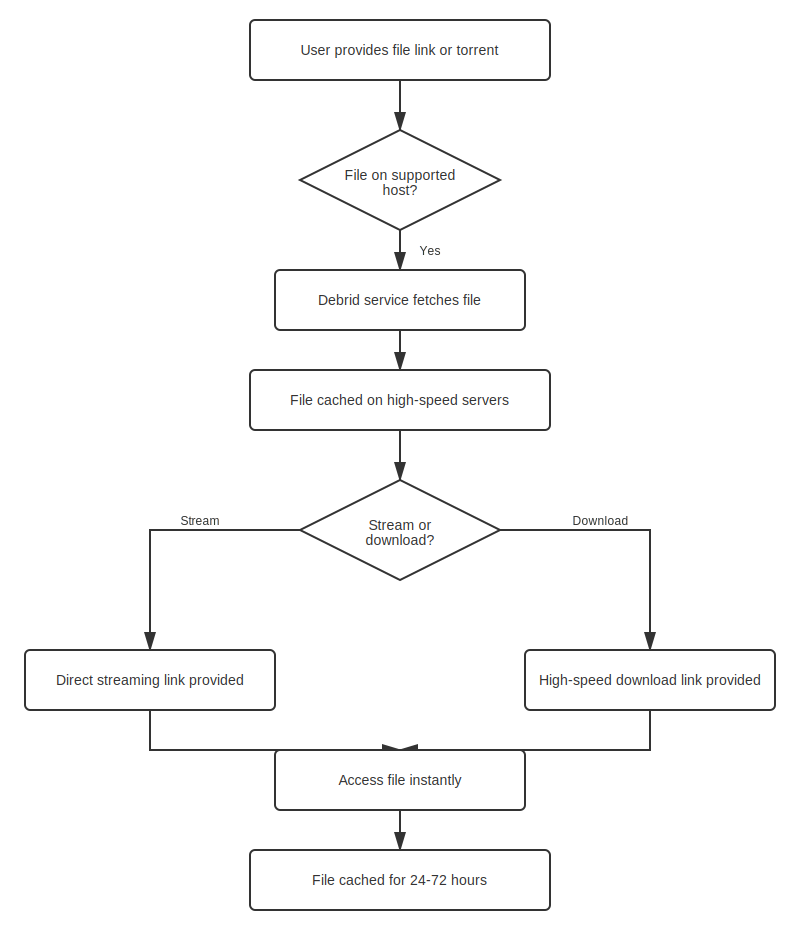

  <h1>
    ⚡ Debrid Services Comparison
  </h1>

  
<strong>Compare leading debrid services for pricing, host coverage, features, and tools</strong>

  

    
    
    
    
  

  

 

**[Intro](#what-are-debrid-services) | [Comparison](#core-features-matrix) | [Pricing](#pricing-comparison)
| [File Hosts](#available-hosts) | [Tools & Apps](#tools-and-applications)**

 

## Table of Contents

👉 Click to expand

- [What are Debrid Services?](#what-are-debrid-services)
  - [Key Benefits](#key-benefits)
  - [How It Works](#how-it-works)
- [Choosing the Right Service](#choosing-the-right-service)
- [Quick Start Guide](#quick-start-guide)
- [Pricing Comparison](#pricing-comparison)
- [Available Hosts](#available-hosts)
  - [Complete Host List](#complete-host-list)
  - [Usenet Support](#usenet-support)
  - [Adult Hosts](#adult-hosts)
  - [Live Status](#live-status)
- [Policies](#policies)
- [🚀 Try the Interactive Web App](#-try-the-interactive-web-app-1)
- [Speed Test](#speed-test)
- [Tools and Applications](#tools-and-applications)
  - [🎬 Media Centers \& Streaming Apps](#-media-centers--streaming-apps)
  - [🔌 Streaming Add-ons](#-streaming-add-ons)
  - [📚 Media Management \& Automation](#-media-management--automation)
  - [📥 Download Managers](#-download-managers)
  - [🌐 Browser Extensions](#-browser-extensions)
  - [📱 Mobile Applications](#-mobile-applications)
- [Community Resources](#community-resources)
- [FAQ](#faq)
- [Disclaimer](#disclaimer)
- [Contributing](#contributing)
- [Support This Project](#support-this-project)

## What are Debrid Services?

Debrid ("multi-hoster") services act as paid aggregation layers between you and dozens/hundreds of individual file hosts. You give them a link (or torrent/magnet) → they fetch, cache, and re-serve it back to you at high speed (often via CDN-like infrastructure) with fewer throttles and no host ads.

### Key Benefits

- **High-speed downloads** - no countdowns or CAPTCHAs
- **One subscription** - access to hundreds of file hosts
- **Remote torrent/magnet fetching** - privacy and seedless downloading
- **Streaming-ready links** - compatible with media servers and apps
- **Cloud storage** - automatic file caching (24-72 hours)
- **API access** - automation and third-party integrations

### How It Works

 

  

 

> [!TIP]
> Think of debrid services as a **premium bridge** between you and file-hosting sites, providing instant access to cached content at maximum speed.

---

## 🚀 Try the Interactive Web App

**Filter, compare, and find your perfect debrid service with our advanced comparison tool!**

---

## Choosing the Right Service

### Core Features Matrix

| Feature | Real-Debrid | AllDebrid | Premiumize | TorBox | Debrid-Link | LinkSnappy | Others |
|:--------|:-----------:|:---------:|:----------:|:------:|:-----------:|:----------:|:------:|
| **Torrent Support** | ✅ | ✅ | ✅ | ✅ | ✅ | ❌ | ✅ |
| **Usenet Access** | ❌ | ❌ | ✅ | ✅ | ❌ | ❌ | Platform Dependent |
| **Free Trial/Tier** | ❌ | ✅   (7-day) | ❌ | ✅ | ❌ | ❌ | Varies |
| **API Access** | ✅ | ✅ | ✅ | ✅ | ✅ | ✅ | ✅ |
| **Mobile Apps** | 3rd-party | PWA | Official | Official | Web | Web | Varies |
| **Cloud Storage** | Temp cache | Temp cache | Yes | Yes | Temp cache | Temp cache | Varies |

 

### 📌 Quick Decision Matrix:

| Your Priority | Recommended Service | See Details |
|:-------------|:-------------------|:-----------|
|**Stremio Streaming** | Real-Debrid | [→ Pricing](#pricing-comparison) |
|**Lowest Price** | AllDebrid | [→ Pricing](#pricing-comparison) |
|**Usenet + Torrents** | Premiumize | [→ Feature Comparison](#feature-comparison) |
|**Try Before Buy** | TorBox | [→ Pricing](#pricing-comparison) |
|**Maximum Hosts** | LinkSnappy | [→ File Hosts](#file-hosts) |
|**Plex/Jellyfin Setup** | Premiumize | [→ Media Tools](#-media-management) |

<strong>🤔 Still not sure? Click here for personalized recommendations</strong>

 

**Choose AllDebrid if:**
- ✅ You want the cheapest reliable option
- ✅ You want to test with a 7-day trial
- ✅ Budget is your top priority

**Choose Premiumize if:**
- ✅ You use Usenet alongside torrents
- ✅ You want premium support
- ✅ Privacy and security are priorities

**Choose TorBox if:**
- ✅ You want to try free first
- ✅ You like modern interfaces
- ✅ You're okay with a newer service

**Choose LinkSnappy if:**
- ✅ You need support for obscure file hosts
- ✅ Maximum host coverage is critical
- ✅ You download from many different sources

 

> [!TIP]
> **Still deciding?** Check our **[File Hosts](#file-hosts)** table or try the **[Interactive Web App](https://debridcompare.pages.dev)** for advanced filtering!

[(↑ Back to Top)](#table-of-contents)

---

## Quick Start Guide

### 3 Simple Steps to Get Started

#### 1. **Choose a Service**:
 - Not sure? See **[Choosing the Right Service](#choosing-the-right-service)** for personalized recommendations
 - Compare **[Pricing](#pricing-comparison)** and **[Host Support](#file-hosts)**

#### 2. **Sign Up & Configure**:
 - Create an account, activate your subscription, and get your API key for tool integrations
 - Most services offer instant activation

#### 3. **Start Using**:
 - Add links/torrents via web interface, install **[browser extensions](#-browser-extensions)**, or integrate with **[media tools](#-media-management)**
 - Files are cached and ready to stream instantly!

> [!TIP]
> **First time?** Try the free tiers ([TorBox](#pricing-comparison), [AllDebrid trial](#pricing-comparison)) or start with a short-term plan to test speeds in your region.

[(↑ Back to Top)](#table-of-contents)

---

## Pricing Comparison

> [!TIP]
> **Best Value Picks:**
> - 🏆 **Budget**: AllDebrid (€2.99/month recurring)
> - 🔥 **Popular**: Real-Debrid (€4.00/month)
> - 🆓 **Free Option**: TorBox (limited features)

### Price Comparison Table

| **Plan Duration** | **AllDebrid** | **Premiumize** | **Real-Debrid** | **TorBox** | **Debrid-Link** | **LinkSnappy** | **Mega-Debrid** | **Deepbrid** | **High-Way** |
| :--- | :--- | :--- | :--- | :--- | :--- | :--- | :--- | :--- | :--- |
| **Free / Trial** | [7-day trial¹](#footnote-1) | ❌ | ❌ | [Free tier²](#footnote-2) | ❌ | ❌ | ❌ | Limited hosts only | [Limited Hosts⁶](#footnote-6) |
| **7 Days** | ❌ | ❌ | ❌ | ❌ | ❌ | $4.99 | ❌ | ❌ | ❌ |
| **15 Days** | [€2.99 (one-time)⁴](#footnote-4) | ❌ | €3.00 | ❌ | €3.00 | ❌ | ❌ | €4.50 | ❌ |
| **30 Days** | [€2.99 (recurring)³](#footnote-3)&lt;br&gt;[€3.99 (one-time)⁴](#footnote-4) | $11.99 | €4.00 | [From $3.00/month⁵](#footnote-5) | €4.00 | $12.99 | €4.00 | €4.99 | From €5.99 |
| **90 Days** | [€8.99 (one-time)⁴](#footnote-4) | $29.99 | €9.00 | ❌ | €9.00 | $29.99 | €9.00 | €12.99 | From €15.99 |
| **180 Days** | [€15.99 (one-time)⁴](#footnote-4) | ❌ | €16.00 | ❌ | €16.00 | $54.99 | €16.00 | €19.99 | From €29.99 |
| **300 Days** | [€24.99 (one-time)⁴](#footnote-4) | ❌ | ❌ | ❌ | €25.00 | ❌ | ❌ | ❌ | ❌ |
| **365 Days / 1 Year** | ❌ | $79.99 | ❌ | [From $33.00/year⁵](#footnote-5) | ❌ | ❌ | ❌ | €32.99 | ❌ |

> [!NOTE]
> - **¹ AllDebrid Free Trial**: 7-day trial requires phone verification. [Verify pricing →](https://alldebrid.com/offer/)
> - **² TorBox Free Tier**: Limited speed and features; no torrenting. [Verify pricing →](https://torbox.app/pricing)
> - **³ AllDebrid Recurring**: Auto-renews monthly at €2.99. [Verify pricing →](https://alldebrid.com/offer/)
> - **⁴ AllDebrid / Debrid-Link One-Time**: Non-recurring payment. Often better value than recurring. [Verify pricing →](https://alldebrid.com/offer/)
> - **⁵ TorBox Tiers**: Multiple plans starting at $3.00/month. Higher tiers unlock more features. [Verify pricing →](https://torbox.app/subscription)
> - **⁶ High-Way**: Limited Hoster, Free MB through activity in the forum. [Verify pricing →](https://high-way.me/pages/tariffs)

### Up-to-date Pricing

> [!TIP]  
> *Always verify prices on official sites as they change frequently.*

👉 Click to expand

| **Service** | **Official Pricing Page**                                                  |
| :---------- | :------------------------------------------------------------------------- |
| AllDebrid   | [alldebrid.com/offer](https://alldebrid.com/offer/)                        |
| Real-Debrid | [real-debrid.com/premium](https://real-debrid.com/premium)                 |
| TorBox      | [torbox.app/pricing](https://torbox.app/pricing)                           |
| Premiumize  | [premiumize.me/premium](https://www.premiumize.me/premium)                 |
| LinkSnappy  | [linksnappy.com/myaccount/extend](https://linksnappy.com/myaccount/extend) |
| Debrid-Link | [debrid-link.com/premium](https://debrid-link.com/premium)                 |
| Mega-Debrid | [mega-debrid.eu/offres](https://www.mega-debrid.eu/index.php?page=offres)  |
| Deepbrid    | [deepbrid.com/signup](https://www.deepbrid.com/signup)                     |
| High-Way    | [high-way.me/pages/tariffs](https://high-way.me/pages/tariffs)             |

 

> **Last updated: May 22, 2026**

 

[(↑ Back to Top)](#table-of-contents)

---

## Available Hosts

> **💡 Pro Tip:** Use the [**interactive web app**](https://debridcompare.pages.dev) for advanced search, filters, and side-by-side comparison!

 

> [!WARNING]
> Real-Debrid has started returning copyright-infringement errors on many cached torrents. Read more on: [Torrent Freak](https://torrentfreak.com/real-debrids-renewed-piracy-crackdown-follows-corporate-restructuring/) 

### Complete Host List

Comprehensive list of all supported file hosts across all services.

<strong>👉 Click to expand complete host list</strong>
 

| **Service Name** | **TorBox** | **AllDebrid** | **Deepbrid** | **Debrid-Link** | **High-Way** | **LinkSnappy** | **Mega-Debrid** | **Premiumize** | **Real-Debrid** |
| :--- | :--- | :--- | :--- | :--- | :--- | :--- | :--- | :--- | :--- |
| 1Fichier | ✅ | ✅ | ✅ | ✅ | ✅ | ✅ | ✅ | ✅ | ✅ |
| 1Tv | ❌ | ❌ | ❌ | ❌ | ❌ | ❌ | ✅ | ❌ | ❌ |
| 2Giga.link | ❌ | ❌ | ❌ | ❌ | ❌ | ❌ | ✅ | ❌ | ❌ |
| 4Chan | ✅ | ❌ | ❌ | ❌ | ❌ | ❌ | ❌ | ❌ | ❌ |
| 4Funbox | ❌ | ❌ | ✅ | ❌ | ❌ | ❌ | ❌ | ❌ | ❌ |
| 4Shared | ✅ | ✅ | ✅ | ❌ | ❌ | ❌ | ❌ | ❌ | ✅ |
| 4Tube | ✅ | ✅ | ❌ | ❌ | ❌ | ❌ | ❌ | ❌ | ❌ |
| 123Pan | ✅ | ❌ | ❌ | ❌ | ❌ | ❌ | ❌ | ❌ | ❌ |
| Abcnews | ✅ | ❌ | ❌ | ❌ | ❌ | ❌ | ✅ | ❌ | ❌ |
| Acast | ✅ | ❌ | ❌ | ❌ | ❌ | ❌ | ✅ | ❌ | ❌ |
| Add-anime | ❌ | ❌ | ❌ | ❌ | ❌ | ❌ | ✅ | ❌ | ❌ |
| Air-mozilla | ❌ | ❌ | ❌ | ❌ | ❌ | ❌ | ✅ | ❌ | ❌ |
| Alfafile | ✅ | ✅ | ✅ | ❌ | ❌ | ❌ | ✅ | ❌ | ❌ |
| Annas archive | ✅ | ❌ | ❌ | ❌ | ❌ | ❌ | ❌ | ❌ | ❌ |
| Anonfiles | ❌ | ❌ | ❌ | ❌ | ❌ | ❌ | ✅ | ❌ | ❌ |
| Aparat | ✅ | ❌ | ❌ | ❌ | ❌ | ❌ | ✅ | ❌ | ❌ |
| Apkadmin | ✅ | ❌ | ❌ | ❌ | ❌ | ❌ | ❌ | ❌ | ❌ |
| Archive.org | ✅ | ✅ | ❌ | ❌ | ❌ | ❌ | ✅ | ✅ | ❌ |
| Audi-mediacenter | ❌ | ❌ | ❌ | ❌ | ❌ | ❌ | ✅ | ❌ | ❌ |
| Audioboom | ✅ | ❌ | ❌ | ❌ | ❌ | ❌ | ✅ | ❌ | ❌ |
| Audiomack | ✅ | ❌ | ❌ | ❌ | ❌ | ❌ | ✅ | ❌ | ❌ |
| Baidu video | ✅ | ❌ | ❌ | ❌ | ❌ | ❌ | ❌ | ❌ | ❌ |
| Bayfiles | ❌ | ❌ | ✅ | ❌ | ❌ | ❌ | ❌ | ❌ | ❌ |
| Bbc | ✅ | ❌ | ❌ | ❌ | ❌ | ❌ | ❌ | ❌ | ❌ |
| Beta hoster | ❌ | ❌ | ❌ | ❌ | ✅ | ❌ | ❌ | ❌ | ❌ |
| Bilibili | ✅ | ❌ | ❌ | ❌ | ❌ | ❌ | ❌ | ❌ | ❌ |
| Bluesky | ✅ | ❌ | ❌ | ❌ | ❌ | ❌ | ❌ | ❌ | ❌ |
| Brupload | ❌ | ❌ | ❌ | ❌ | ❌ | ❌ | ❌ | ❌ | ✅ |
| Buenastareas | ❌ | ❌ | ✅ | ❌ | ❌ | ❌ | ❌ | ❌ | ❌ |
| Bunkr | ✅ | ❌ | ❌ | ❌ | ❌ | ❌ | ❌ | ❌ | ❌ |
| Buzzheavier | ✅ | ❌ | ❌ | ❌ | ❌ | ❌ | ❌ | ❌ | ❌ |
| Calameo | ❌ | ❌ | ✅ | ❌ | ❌ | ❌ | ✅ | ❌ | ❌ |
| Camdemy | ✅ | ❌ | ❌ | ❌ | ❌ | ❌ | ✅ | ❌ | ❌ |
| Canalplus | ❌ | ✅ | ❌ | ❌ | ❌ | ❌ | ❌ | ❌ | ❌ |
| Castbox | ✅ | ❌ | ❌ | ❌ | ❌ | ❌ | ❌ | ❌ | ❌ |
| Catbox | ✅ | ❌ | ❌ | ❌ | ❌ | ❌ | ❌ | ❌ | ❌ |
| Cc.com | ❌ | ❌ | ❌ | ❌ | ❌ | ❌ | ✅ | ❌ | ❌ |
| Chilloutzone | ✅ | ❌ | ❌ | ❌ | ❌ | ❌ | ✅ | ❌ | ❌ |
| Cinemassacre | ❌ | ❌ | ❌ | ❌ | ❌ | ❌ | ✅ | ❌ | ❌ |
| Clicknupload | ✅ | ❌ | ✅ | ✅ | ❌ | ✅ | ❌ | ✅ | ✅ |
| Clipfish | ❌ | ❌ | ❌ | ❌ | ❌ | ❌ | ✅ | ❌ | ❌ |
| Clipsyndicate | ❌ | ❌ | ❌ | ❌ | ❌ | ❌ | ✅ | ❌ | ❌ |
| Cloudvideo | ❌ | ❌ | ❌ | ❌ | ❌ | ❌ | ❌ | ✅ | ❌ |
| Clubic | ❌ | ❌ | ❌ | ❌ | ❌ | ❌ | ✅ | ❌ | ❌ |
| Collegehumor | ❌ | ❌ | ❌ | ❌ | ❌ | ❌ | ✅ | ❌ | ❌ |
| Comedy central | ✅ | ✅ | ❌ | ❌ | ❌ | ❌ | ❌ | ❌ | ❌ |
| Coomer | ❌ | ❌ | ❌ | ❌ | ❌ | ❌ | ❌ | ❌ | ❌ |
| Cyberdrop | ✅ | ❌ | ❌ | ❌ | ❌ | ❌ | ❌ | ❌ | ❌ |
| Daclips | ❌ | ❌ | ❌ | ❌ | ❌ | ❌ | ✅ | ❌ | ❌ |
| Dagbladet | ❌ | ❌ | ❌ | ❌ | ❌ | ❌ | ✅ | ❌ | ❌ |
| Dailymail | ✅ | ❌ | ❌ | ❌ | ❌ | ❌ | ✅ | ❌ | ❌ |
| Dailymotion | ✅ | ✅ | ✅ | ❌ | ❌ | ❌ | ❌ | ❌ | ✅ |
| Dailyuploads | ✅ | ✅ | ✅ | ✅ | ❌ | ❌ | ✅ | ❌ | ✅ |
| Darkibox | ✅ | ❌ | ❌ | ❌ | ❌ | ❌ | ❌ | ❌ | ❌ |
| Data nodes | ✅ | ❌ | ❌ | ❌ | ❌ | ❌ | ❌ | ❌ | ❌ |
| Datafilehost | ❌ | ❌ | ❌ | ❌ | ❌ | ❌ | ✅ | ❌ | ❌ |
| Datavaults | ✅ | ❌ | ❌ | ❌ | ❌ | ❌ | ❌ | ❌ | ❌ |
| Dctp | ✅ | ❌ | ❌ | ❌ | ❌ | ❌ | ✅ | ❌ | ❌ |
| Ddl | ❌ | ❌ | ✅ | ❌ | ❌ | ❌ | ❌ | ❌ | ✅ |
| Ddl.to | ❌ | ❌ | ❌ | ❌ | ❌ | ✅ | ❌ | ❌ | ❌ |
| Ddownload | ✅ | ❌ | ✅ | ✅ | ❌ | ❌ | ✅ | ❌ | ✅ |
| Depositfiles | ❌ | ❌ | ✅ | ❌ | ❌ | ❌ | ❌ | ❌ | ❌ |
| Deviantart | ✅ | ❌ | ❌ | ❌ | ❌ | ❌ | ❌ | ❌ | ❌ |
| Dfiles | ❌ | ❌ | ✅ | ❌ | ❌ | ❌ | ❌ | ❌ | ❌ |
| Discovery channel | ❌ | ❌ | ❌ | ❌ | ❌ | ❌ | ✅ | ❌ | ❌ |
| Dotsub | ❌ | ❌ | ❌ | ❌ | ❌ | ❌ | ✅ | ❌ | ❌ |
| Driveseed | ✅ | ❌ | ❌ | ❌ | ❌ | ❌ | ❌ | ❌ | ❌ |
| Drop | ❌ | ❌ | ✅ | ❌ | ❌ | ❌ | ❌ | ❌ | ❌ |
| Drop.download | ❌ | ✅ | ❌ | ✅ | ✅ | ❌ | ✅ | ✅ | ❌ |
| Dropapk | ✅ | ❌ | ✅ | ❌ | ❌ | ❌ | ❌ | ❌ | ❌ |
| Dropbox | ✅ | ❌ | ❌ | ✅ | ❌ | ❌ | ❌ | ❌ | ✅ |
| Dropgalaxy | ❌ | ✅ | ❌ | ❌ | ❌ | ❌ | ❌ | ❌ | ❌ |
| Dropmefiles | ❌ | ❌ | ❌ | ❌ | ❌ | ❌ | ✅ | ❌ | ❌ |
| Drtuber | ❌ | ❌ | ❌ | ❌ | ❌ | ❌ | ❌ | ❌ | ❌ |
| Easybytez | ❌ | ❌ | ✅ | ❌ | ❌ | ❌ | ❌ | ❌ | ❌ |
| Ebaumsworld | ✅ | ❌ | ❌ | ❌ | ❌ | ❌ | ✅ | ❌ | ❌ |
| Elitefile | ❌ | ❌ | ❌ | ✅ | ❌ | ❌ | ❌ | ❌ | ❌ |
| Ellentv | ❌ | ❌ | ❌ | ❌ | ❌ | ❌ | ✅ | ❌ | ❌ |
| Emload | ❌ | ❌ | ✅ | ✅ | ❌ | ❌ | ❌ | ❌ | ❌ |
| Exload | ❌ | ✅ | ❌ | ❌ | ❌ | ❌ | ❌ | ❌ | ❌ |
| Extmatrix | ✅ | ❌ | ✅ | ❌ | ❌ | ❌ | ❌ | ❌ | ❌ |
| Facebook | ✅ | ❌ | ❌ | ❌ | ❌ | ❌ | ❌ | ❌ | ❌ |
| Fansly | ✅ | ❌ | ❌ | ❌ | ❌ | ❌ | ❌ | ❌ | ❌ |
| Fastbit | ❌ | ✅ | ❌ | ❌ | ❌ | ❌ | ❌ | ❌ | ❌ |
| Fastfile | ❌ | ❌ | ✅ | ❌ | ❌ | ❌ | ❌ | ❌ | ❌ |
| Fikper | ❌ | ❌ | ❌ | ✅ | ❌ | ❌ | ✅ | ❌ | ❌ |
| File | ❌ | ❌ | ✅ | ❌ | ❌ | ❌ | ❌ | ❌ | ✅ |
| File-upload | ❌ | ❌ | ❌ | ❌ | ❌ | ❌ | ✅ | ❌ | ❌ |
| File.al | ❌ | ✅ | ❌ | ✅ | ❌ | ❌ | ❌ | ✅ | ❌ |
| File4safe | ❌ | ❌ | ✅ | ❌ | ❌ | ❌ | ❌ | ❌ | ❌ |
| Fileaxa | ❌ | ❌ | ✅ | ✅ | ❌ | ❌ | ❌ | ❌ | ❌ |
| Fileblade | ❌ | ❌ | ✅ | ❌ | ❌ | ❌ | ❌ | ❌ | ❌ |
| Filecat | ❌ | ❌ | ✅ | ✅ | ❌ | ❌ | ❌ | ❌ | ❌ |
| Filecrypt | ✅ | ❌ | ❌ | ❌ | ❌ | ❌ | ❌ | ❌ | ❌ |
| Filedot | ❌ | ✅ | ❌ | ✅ | ❌ | ❌ | ❌ | ❌ | ❌ |
| Filefactory | ✅ | ❌ | ✅ | ❌ | ✅ | ✅ | ✅ | ✅ | ✅ |
| Filefox | ❌ | ❌ | ❌ | ❌ | ❌ | ✅ | ❌ | ❌ | ❌ |
| Fileland | ❌ | ❌ | ❌ | ✅ | ❌ | ❌ | ❌ | ❌ | ❌ |
| Filenext | ❌ | ❌ | ✅ | ❌ | ❌ | ❌ | ❌ | ✅ | ❌ |
| Filepress | ✅ | ❌ | ❌ | ❌ | ❌ | ❌ | ❌ | ❌ | ❌ |
| Fileq | ✅ | ❌ | ❌ | ❌ | ❌ | ❌ | ❌ | ❌ | ❌ |
| Filer | ✅ | ❌ | ✅ | ❌ | ❌ | ❌ | ❌ | ❌ | ❌ |
| Filer.net | ❌ | ❌ | ❌ | ✅ | ✅ | ✅ | ✅ | ❌ | ❌ |
| Filerio | ❌ | ✅ | ❌ | ❌ | ❌ | ❌ | ❌ | ❌ | ❌ |
| Files.vc | ✅ | ❌ | ❌ | ❌ | ❌ | ❌ | ❌ | ❌ | ❌ |
| Filesfly | ❌ | ❌ | ❌ | ✅ | ❌ | ❌ | ❌ | ❌ | ❌ |
| Filesmonster | ❌ | ❌ | ✅ | ❌ | ❌ | ❌ | ❌ | ❌ | ❌ |
| Filespace | ✅ | ✅ | ✅ | ✅ | ❌ | ❌ | ❌ | ❌ | ✅ |
| Filestank | ❌ | ❌ | ❌ | ❌ | ❌ | ❌ | ✅ | ❌ | ❌ |
| Filestore | ✅ | ❌ | ✅ | ✅ | ✅ | ❌ | ✅ | ✅ | ✅ |
| Filextras | ❌ | ❌ | ✅ | ✅ | ❌ | ❌ | ❌ | ❌ | ✅ |
| Filezip | ❌ | ✅ | ❌ | ❌ | ❌ | ❌ | ❌ | ❌ | ❌ |
| Fireget | ❌ | ❌ | ✅ | ❌ | ❌ | ❌ | ❌ | ❌ | ❌ |
| Flipagram | ❌ | ❌ | ❌ | ❌ | ❌ | ❌ | ✅ | ❌ | ❌ |
| Flix555 | ❌ | ❌ | ❌ | ❌ | ❌ | ❌ | ✅ | ❌ | ❌ |
| Formula1 | ✅ | ❌ | ❌ | ❌ | ❌ | ❌ | ✅ | ❌ | ❌ |
| Foxnews | ✅ | ❌ | ❌ | ❌ | ❌ | ❌ | ✅ | ❌ | ❌ |
| Free | ❌ | ❌ | ❌ | ❌ | ❌ | ❌ | ✅ | ❌ | ❌ |
| Fuckingfast | ✅ | ❌ | ❌ | ❌ | ❌ | ❌ | ❌ | ❌ | ❌ |
| Gamersyde | ❌ | ❌ | ❌ | ❌ | ❌ | ❌ | ✅ | ❌ | ❌ |
| Gamestar | ✅ | ❌ | ❌ | ❌ | ❌ | ❌ | ✅ | ❌ | ❌ |
| Gelbooru | ✅ | ❌ | ❌ | ❌ | ❌ | ❌ | ❌ | ❌ | ❌ |
| Gigapeta | ❌ | ✅ | ✅ | ✅ | ❌ | ❌ | ❌ | ❌ | ✅ |
| Github | ✅ | ❌ | ❌ | ❌ | ❌ | ❌ | ❌ | ❌ | ❌ |
| Gofile | ✅ | ❌ | ✅ | ✅ | ❌ | ❌ | ❌ | ❌ | ❌ |
| Google | ❌ | ✅ | ❌ | ❌ | ❌ | ❌ | ❌ | ✅ | ❌ |
| Google drive | ✅ | ❌ | ❌ | ✅ | ❌ | ❌ | ❌ | ❌ | ✅ |
| Gorillavid | ❌ | ❌ | ❌ | ❌ | ❌ | ❌ | ✅ | ❌ | ❌ |
| Hexload | ✅ | ❌ | ✅ | ❌ | ❌ | ❌ | ❌ | ❌ | ✅ |
| Hexupload / hexload | ❌ | ✅ | ❌ | ✅ | ❌ | ❌ | ❌ | ✅ | ✅ |
| Hitfile | ✅ | ✅ | ✅ | ✅ | ❌ | ✅ | ✅ | ✅ | ✅ |
| Hitomi | ✅ | ❌ | ❌ | ❌ | ❌ | ❌ | ❌ | ❌ | ❌ |
| Hot4share | ❌ | ✅ | ✅ | ❌ | ❌ | ❌ | ❌ | ❌ | ❌ |
| Hotlink | ❌ | ❌ | ✅ | ❌ | ❌ | ✅ | ✅ | ❌ | ❌ |
| Hubcloud | ✅ | ❌ | ❌ | ❌ | ❌ | ❌ | ❌ | ❌ | ❌ |
| Hubdrive | ✅ | ❌ | ❌ | ❌ | ❌ | ❌ | ❌ | ❌ | ❌ |
| Hulkshare | ❌ | ❌ | ✅ | ✅ | ❌ | ❌ | ❌ | ❌ | ❌ |
| Icerbox | ❌ | ❌ | ✅ | ❌ | ❌ | ❌ | ❌ | ❌ | ❌ |
| Icloud drive | ❌ | ❌ | ❌ | ✅ | ❌ | ❌ | ❌ | ❌ | ✅ |
| Idnes | ✅ | ❌ | ❌ | ❌ | ❌ | ❌ | ✅ | ❌ | ❌ |
| Imgbb | ✅ | ❌ | ❌ | ❌ | ❌ | ❌ | ❌ | ❌ | ❌ |
| Imgur | ✅ | ❌ | ❌ | ❌ | ❌ | ❌ | ❌ | ❌ | ❌ |
| Indishare | ❌ | ✅ | ❌ | ❌ | ❌ | ❌ | ❌ | ❌ | ❌ |
| Infrastructure | ❌ | ❌ | ❌ | ✅ | ❌ | ❌ | ❌ | ❌ | ❌ |
| Instagram | ✅ | ❌ | ❌ | ❌ | ❌ | ❌ | ✅ | ❌ | ❌ |
| Isra.cloud | ❌ | ✅ | ❌ | ✅ | ✅ | ✅ | ✅ | ✅ | ✅ |
| Isracloud | ✅ | ❌ | ❌ | ❌ | ❌ | ❌ | ❌ | ❌ | ❌ |
| Issuu | ❌ | ❌ | ✅ | ❌ | ❌ | ❌ | ✅ | ❌ | ❌ |
| Izlesene | ✅ | ❌ | ❌ | ❌ | ❌ | ❌ | ✅ | ❌ | ❌ |
| Jamendo | ✅ | ❌ | ❌ | ❌ | ❌ | ❌ | ✅ | ❌ | ❌ |
| Jumploads | ❌ | ❌ | ✅ | ✅ | ❌ | ❌ | ❌ | ❌ | ❌ |
| K2s | ❌ | ❌ | ✅ | ❌ | ❌ | ❌ | ❌ | ❌ | ❌ |
| K2s (keep2share) | ❌ | ❌ | ❌ | ❌ | ✅ | ✅ | ❌ | ❌ | ❌ |
| Karrierevideos | ❌ | ❌ | ❌ | ❌ | ❌ | ❌ | ✅ | ❌ | ❌ |
| Katfile | ✅ | ✅ | ✅ | ✅ | ✅ | ✅ | ✅ | ✅ | ✅ |
| Keek | ❌ | ❌ | ❌ | ❌ | ❌ | ❌ | ✅ | ❌ | ❌ |
| Keep2share | ❌ | ❌ | ✅ | ❌ | ❌ | ❌ | ❌ | ❌ | ❌ |
| Kenfiles | ❌ | ❌ | ✅ | ❌ | ❌ | ❌ | ❌ | ❌ | ❌ |
| Khanacademy | ✅ | ❌ | ❌ | ❌ | ❌ | ❌ | ✅ | ❌ | ❌ |
| Kick | ✅ | ❌ | ❌ | ❌ | ❌ | ❌ | ❌ | ❌ | ❌ |
| Kickstarter | ✅ | ❌ | ❌ | ❌ | ❌ | ❌ | ✅ | ❌ | ❌ |
| Koofr | ✅ | ❌ | ❌ | ❌ | ❌ | ❌ | ❌ | ❌ | ❌ |
| Krakenfiles | ✅ | ❌ | ✅ | ❌ | ❌ | ❌ | ❌ | ❌ | ❌ |
| Kshared | ❌ | ❌ | ❌ | ✅ | ❌ | ❌ | ❌ | ❌ | ❌ |
| Kvid | ❌ | ❌ | ❌ | ❌ | ❌ | ❌ | ✅ | ❌ | ❌ |
| Lcp | ✅ | ❌ | ❌ | ❌ | ❌ | ❌ | ✅ | ❌ | ❌ |
| Liveleak | ❌ | ❌ | ❌ | ❌ | ❌ | ❌ | ✅ | ❌ | ❌ |
| Loom | ✅ | ❌ | ❌ | ❌ | ❌ | ❌ | ❌ | ❌ | ❌ |
| Lynda | ❌ | ✅ | ❌ | ❌ | ❌ | ❌ | ❌ | ❌ | ❌ |
| Mangadex | ✅ | ❌ | ❌ | ❌ | ❌ | ❌ | ❌ | ❌ | ❌ |
| Mediaccc | ❌ | ❌ | ❌ | ❌ | ❌ | ❌ | ✅ | ❌ | ❌ |
| Mediafire | ✅ | ✅ | ✅ | ✅ | ❌ | ✅ | ✅ | ✅ | ✅ |
| Mega | ✅ | ✅ | ✅ | ✅ | ✅ | ✅ | ✅ | ✅ | ✅ |
| Megadb | ✅ | ❌ | ❌ | ❌ | ❌ | ❌ | ❌ | ❌ | ❌ |
| Megaup | ✅ | ❌ | ❌ | ❌ | ❌ | ❌ | ❌ | ❌ | ❌ |
| Metacafe | ❌ | ❌ | ❌ | ❌ | ❌ | ❌ | ✅ | ❌ | ❌ |
| Mexashare | ❌ | ✅ | ❌ | ✅ | ❌ | ❌ | ❌ | ❌ | ❌ |
| Mirrobox | ❌ | ❌ | ✅ | ❌ | ❌ | ❌ | ❌ | ❌ | ❌ |
| Mixcloud | ❌ | ❌ | ❌ | ❌ | ❌ | ❌ | ✅ | ❌ | ❌ |
| Mixdrop | ✅ | ✅ | ❌ | ✅ | ❌ | ❌ | ❌ | ❌ | ❌ |
| Modsbase | ❌ | ✅ | ❌ | ❌ | ❌ | ❌ | ❌ | ✅ | ❌ |
| Movieclips | ❌ | ❌ | ❌ | ❌ | ❌ | ❌ | ✅ | ❌ | ❌ |
| Movpod | ❌ | ❌ | ❌ | ❌ | ❌ | ❌ | ✅ | ❌ | ❌ |
| Mp4upload | ❌ | ✅ | ❌ | ❌ | ❌ | ❌ | ❌ | ❌ | ❌ |
| Msnbc | ❌ | ❌ | ❌ | ❌ | ❌ | ❌ | ✅ | ❌ | ❌ |
| Myspass | ❌ | ❌ | ❌ | ❌ | ❌ | ❌ | ✅ | ❌ | ❌ |
| Nbcsports | ✅ | ❌ | ❌ | ❌ | ❌ | ❌ | ✅ | ❌ | ❌ |
| Ndtv | ❌ | ❌ | ❌ | ❌ | ❌ | ❌ | ✅ | ❌ | ❌ |
| Nelion | ❌ | ❌ | ❌ | ✅ | ❌ | ❌ | ❌ | ❌ | ❌ |
| Nexusmods | ✅ | ❌ | ❌ | ❌ | ❌ | ❌ | ❌ | ❌ | ❌ |
| Nfl | ✅ | ❌ | ❌ | ❌ | ❌ | ❌ | ✅ | ❌ | ❌ |
| Niconico | ✅ | ✅ | ❌ | ❌ | ❌ | ❌ | ❌ | ❌ | ❌ |
| Nitroflare | ✅ | ❌ | ✅ | ❌ | ✅ | ❌ | ❌ | ❌ | ❌ |
| Nytimes | ✅ | ✅ | ❌ | ❌ | ❌ | ❌ | ❌ | ✅ | ❌ |
| Oboom | ❌ | ❌ | ✅ | ❌ | ❌ | ❌ | ❌ | ❌ | ❌ |
| Odatv | ❌ | ❌ | ❌ | ❌ | ❌ | ❌ | ✅ | ❌ | ❌ |
| Odnoklassniki | ✅ | ✅ | ❌ | ❌ | ❌ | ❌ | ❌ | ❌ | ❌ |
| Ok.ru | ❌ | ❌ | ❌ | ❌ | ❌ | ❌ | ✅ | ❌ | ❌ |
| Onionstudios | ❌ | ❌ | ❌ | ❌ | ❌ | ❌ | ✅ | ❌ | ❌ |
| Pan baidu | ✅ | ❌ | ❌ | ❌ | ❌ | ❌ | ❌ | ❌ | ❌ |
| Panopto | ✅ | ❌ | ❌ | ❌ | ❌ | ❌ | ❌ | ❌ | ❌ |
| Pikpak | ✅ | ❌ | ❌ | ❌ | ❌ | ❌ | ❌ | ❌ | ❌ |
| Pillowcase | ✅ | ❌ | ❌ | ❌ | ❌ | ❌ | ❌ | ❌ | ❌ |
| Pinkbike | ❌ | ❌ | ❌ | ❌ | ❌ | ❌ | ✅ | ❌ | ❌ |
| Pinterest | ✅ | ❌ | ❌ | ❌ | ❌ | ❌ | ❌ | ❌ | ❌ |
| Piwi+ | ❌ | ❌ | ❌ | ❌ | ❌ | ❌ | ✅ | ❌ | ❌ |
| Pixeldrain | ✅ | ❌ | ❌ | ✅ | ❌ | ❌ | ✅ | ❌ | ❌ |
| Plays | ❌ | ❌ | ❌ | ❌ | ❌ | ❌ | ✅ | ❌ | ❌ |
| Playtvak | ❌ | ❌ | ❌ | ❌ | ❌ | ❌ | ✅ | ❌ | ❌ |
| Prefiles | ❌ | ✅ | ✅ | ✅ | ❌ | ❌ | ❌ | ❌ | ✅ |
| Pyvideo | ❌ | ❌ | ❌ | ❌ | ❌ | ❌ | ✅ | ❌ | ❌ |
| Qiwi | ✅ | ❌ | ❌ | ❌ | ❌ | ❌ | ❌ | ❌ | ❌ |
| Radiotunes | ❌ | ❌ | ✅ | ❌ | ❌ | ❌ | ❌ | ❌ | ✅ |
| Rapidgator | ✅ | ✅ | ✅ | ✅ | ✅ | ✅ | ✅ | ✅ | ✅ |
| Rapidrar | ✅ | ❌ | ✅ | ❌ | ❌ | ❌ | ❌ | ❌ | ❌ |
| Reddit | ✅ | ❌ | ❌ | ❌ | ❌ | ❌ | ❌ | ❌ | ❌ |
| Revision3 | ❌ | ❌ | ❌ | ❌ | ❌ | ❌ | ✅ | ❌ | ❌ |
| Rg | ❌ | ❌ | ✅ | ❌ | ❌ | ❌ | ❌ | ❌ | ❌ |
| Rosefile | ❌ | ❌ | ❌ | ❌ | ❌ | ❌ | ❌ | ❌ | ❌ |
| Rtbf | ❌ | ✅ | ❌ | ❌ | ❌ | ❌ | ❌ | ❌ | ❌ |
| Rte | ❌ | ❌ | ❌ | ❌ | ❌ | ❌ | ✅ | ❌ | ❌ |
| Rts | ❌ | ✅ | ❌ | ❌ | ❌ | ❌ | ❌ | ❌ | ❌ |
| Rtve.es | ❌ | ✅ | ❌ | ❌ | ❌ | ❌ | ❌ | ✅ | ❌ |
| Ruhd | ❌ | ❌ | ❌ | ❌ | ❌ | ❌ | ✅ | ❌ | ❌ |
| Rutube | ✅ | ✅ | ✅ | ❌ | ❌ | ❌ | ❌ | ❌ | ❌ |
| Ruutu | ❌ | ❌ | ❌ | ❌ | ❌ | ❌ | ✅ | ❌ | ❌ |
| Safedock | ❌ | ❌ | ✅ | ❌ | ❌ | ❌ | ❌ | ❌ | ❌ |
| Salefiles | ❌ | ❌ | ✅ | ❌ | ❌ | ❌ | ❌ | ❌ | ❌ |
| Scribd | ✅ | ✅ | ✅ | ✅ | ❌ | ❌ | ❌ | ❌ | ✅ |
| Send | ✅ | ❌ | ❌ | ❌ | ❌ | ❌ | ❌ | ❌ | ✅ |
| Sendit | ❌ | ✅ | ❌ | ❌ | ❌ | ❌ | ❌ | ❌ | ❌ |
| Sendspace | ✅ | ❌ | ✅ | ❌ | ❌ | ❌ | ❌ | ❌ | ✅ |
| Servers | ❌ | ❌ | ❌ | ✅ | ❌ | ❌ | ❌ | ❌ | ❌ |
| Sharemods | ✅ | ✅ | ❌ | ❌ | ❌ | ❌ | ❌ | ❌ | ❌ |
| Silkfiles | ❌ | ❌ | ❌ | ✅ | ❌ | ❌ | ❌ | ❌ | ❌ |
| Simfileshare | ❌ | ✅ | ❌ | ❌ | ❌ | ❌ | ✅ | ❌ | ❌ |
| Slideshare | ❌ | ❌ | ✅ | ❌ | ❌ | ❌ | ❌ | ❌ | ❌ |
| Smotri | ❌ | ❌ | ❌ | ❌ | ❌ | ❌ | ✅ | ❌ | ❌ |
| Snagfilms | ❌ | ❌ | ❌ | ❌ | ❌ | ❌ | ✅ | ❌ | ❌ |
| Snapchat | ✅ | ❌ | ❌ | ❌ | ❌ | ❌ | ❌ | ❌ | ❌ |
| Snotr | ❌ | ❌ | ❌ | ❌ | ❌ | ❌ | ✅ | ❌ | ❌ |
| Solidfiles | ❌ | ❌ | ✅ | ❌ | ❌ | ✅ | ❌ | ❌ | ❌ |
| Soundcloud | ✅ | ✅ | ✅ | ✅ | ❌ | ❌ | ❌ | ✅ | ❌ |
| Sportdeutschland | ❌ | ❌ | ❌ | ❌ | ❌ | ❌ | ✅ | ❌ | ❌ |
| Steam | ✅ | ✅ | ❌ | ❌ | ❌ | ❌ | ✅ | ❌ | ❌ |
| Steam (video) | ❌ | ❌ | ❌ | ❌ | ❌ | ❌ | ❌ | ❌ | ❌ |
| Stream.cz | ❌ | ❌ | ❌ | ❌ | ❌ | ❌ | ✅ | ❌ | ❌ |
| Streamable | ✅ | ❌ | ❌ | ❌ | ❌ | ❌ | ✅ | ❌ | ❌ |
| Streamcloud | ❌ | ❌ | ❌ | ❌ | ❌ | ❌ | ✅ | ❌ | ❌ |
| Streamtape | ✅ | ❌ | ❌ | ❌ | ❌ | ❌ | ✅ | ✅ | ❌ |
| Subyshare | ❌ | ❌ | ✅ | ❌ | ❌ | ❌ | ❌ | ❌ | ❌ |
| Swisstransfer | ✅ | ❌ | ❌ | ❌ | ❌ | ❌ | ❌ | ❌ | ❌ |
| Swrmediathek | ❌ | ❌ | ❌ | ❌ | ❌ | ❌ | ✅ | ❌ | ❌ |
| Syncs | ❌ | ❌ | ✅ | ❌ | ❌ | ❌ | ❌ | ❌ | ❌ |
| Sztv | ❌ | ❌ | ❌ | ❌ | ❌ | ❌ | ✅ | ❌ | ❌ |
| Takefile | ❌ | ❌ | ✅ | ❌ | ❌ | ❌ | ❌ | ❌ | ❌ |
| Teachertube | ❌ | ❌ | ❌ | ❌ | ❌ | ❌ | ✅ | ❌ | ❌ |
| Teachingchannel | ❌ | ❌ | ❌ | ❌ | ❌ | ❌ | ✅ | ❌ | ❌ |
| Teamfourstar | ❌ | ❌ | ❌ | ❌ | ❌ | ❌ | ✅ | ❌ | ❌ |
| Techtalks | ❌ | ❌ | ❌ | ❌ | ❌ | ❌ | ✅ | ❌ | ❌ |
| Ted | ❌ | ❌ | ❌ | ❌ | ❌ | ❌ | ✅ | ❌ | ❌ |
| Telebruxelles | ❌ | ❌ | ❌ | ❌ | ❌ | ❌ | ✅ | ❌ | ❌ |
| Terabox | ✅ | ❌ | ✅ | ✅ | ❌ | ❌ | ❌ | ❌ | ❌ |
| Terabytez | ✅ | ❌ | ✅ | ✅ | ❌ | ❌ | ❌ | ❌ | ✅ |
| Tezfiles | ❌ | ❌ | ❌ | ✅ | ❌ | ✅ | ❌ | ❌ | ❌ |
| Tiktok | ✅ | ❌ | ❌ | ❌ | ❌ | ❌ | ❌ | ❌ | ❌ |
| Tlc | ✅ | ❌ | ❌ | ❌ | ❌ | ❌ | ❌ | ❌ | ❌ |
| Transfer.it | ✅ | ❌ | ❌ | ❌ | ❌ | ❌ | ❌ | ❌ | ❌ |
| Transfert.free | ❌ | ❌ | ✅ | ❌ | ❌ | ❌ | ❌ | ❌ | ❌ |
| Trilulilu | ❌ | ❌ | ❌ | ❌ | ❌ | ❌ | ✅ | ❌ | ❌ |
| Tubitv | ❌ | ❌ | ❌ | ❌ | ❌ | ❌ | ✅ | ❌ | ❌ |
| Tumblr | ✅ | ❌ | ❌ | ❌ | ❌ | ❌ | ❌ | ❌ | ❌ |
| Turbobit | ✅ | ✅ | ✅ | ✅ | ✅ | ✅ | ✅ | ✅ | ✅ |
| Tusfiles | ❌ | ❌ | ✅ | ❌ | ❌ | ❌ | ❌ | ❌ | ❌ |
| Tv4 | ❌ | ❌ | ❌ | ❌ | ❌ | ❌ | ✅ | ❌ | ❌ |
| Tweakers | ❌ | ❌ | ❌ | ❌ | ❌ | ❌ | ✅ | ❌ | ❌ |
| Twitch | ✅ | ✅ | ❌ | ❌ | ❌ | ❌ | ✅ | ❌ | ❌ |
| Twitter | ✅ | ❌ | ❌ | ❌ | ❌ | ❌ | ❌ | ❌ | ❌ |
| Upload42 | ❌ | ✅ | ❌ | ❌ | ❌ | ❌ | ❌ | ❌ | ❌ |
| Uploadbank | ❌ | ✅ | ❌ | ❌ | ❌ | ❌ | ❌ | ❌ | ❌ |
| Uploadbox | ❌ | ✅ | ❌ | ❌ | ❌ | ❌ | ❌ | ❌ | ❌ |
| Uploadboy | ❌ | ✅ | ✅ | ❌ | ❌ | ❌ | ❌ | ✅ | ❌ |
| Uploadgig | ❌ | ❌ | ✅ | ❌ | ❌ | ❌ | ❌ | ❌ | ❌ |
| Uploadhaven | ✅ | ❌ | ✅ | ❌ | ❌ | ❌ | ❌ | ❌ | ❌ |
| Uploadrar | ❌ | ✅ | ❌ | ❌ | ❌ | ❌ | ❌ | ✅ | ❌ |
| Uploady | ✅ | ❌ | ❌ | ✅ | ❌ | ❌ | ✅ | ❌ | ✅ |
| Uptobox | ❌ | ❌ | ✅ | ❌ | ❌ | ❌ | ❌ | ❌ | ❌ |
| Upvid | ❌ | ❌ | ❌ | ✅ | ❌ | ❌ | ❌ | ❌ | ❌ |
| Uqload | ❌ | ❌ | ❌ | ✅ | ❌ | ❌ | ❌ | ❌ | ❌ |
| Userscloud | ❌ | ❌ | ✅ | ❌ | ❌ | ❌ | ❌ | ❌ | ❌ |
| Usersdrive | ❌ | ✅ | ❌ | ✅ | ❌ | ❌ | ❌ | ✅ | ❌ |
| Ustream | ❌ | ❌ | ❌ | ❌ | ❌ | ❌ | ✅ | ❌ | ❌ |
| Veoh | ❌ | ❌ | ❌ | ❌ | ❌ | ❌ | ❌ | ✅ | ❌ |
| Verystream | ❌ | ❌ | ❌ | ❌ | ❌ | ❌ | ✅ | ❌ | ❌ |
| Vev | ❌ | ❌ | ❌ | ❌ | ❌ | ❌ | ✅ | ❌ | ❌ |
| Vidabc | ❌ | ❌ | ❌ | ❌ | ❌ | ❌ | ✅ | ❌ | ❌ |
| Videodetective | ❌ | ❌ | ❌ | ❌ | ❌ | ❌ | ✅ | ❌ | ❌ |
| Vidoza | ❌ | ✅ | ✅ | ✅ | ❌ | ❌ | ✅ | ✅ | ❌ |
| Vidspot | ❌ | ❌ | ❌ | ❌ | ❌ | ❌ | ✅ | ❌ | ❌ |
| Vidto | ❌ | ❌ | ❌ | ❌ | ❌ | ❌ | ✅ | ❌ | ❌ |
| Vidzi | ❌ | ❌ | ❌ | ❌ | ❌ | ❌ | ✅ | ❌ | ❌ |
| Viking file | ✅ | ❌ | ❌ | ❌ | ❌ | ❌ | ❌ | ❌ | ❌ |
| Vimeo | ✅ | ✅ | ✅ | ❌ | ❌ | ❌ | ❌ | ❌ | ✅ |
| Vk | ✅ | ❌ | ❌ | ❌ | ❌ | ❌ | ❌ | ✅ | ❌ |
| Vlive | ❌ | ❌ | ❌ | ❌ | ❌ | ❌ | ✅ | ❌ | ❌ |
| Vodlocker | ❌ | ❌ | ❌ | ❌ | ❌ | ❌ | ✅ | ❌ | ❌ |
| Voe | ❌ | ❌ | ❌ | ❌ | ❌ | ❌ | ❌ | ❌ | ✅ |
| Vup | ❌ | ❌ | ❌ | ❌ | ❌ | ❌ | ✅ | ❌ | ❌ |
| Wayupload | ❌ | ✅ | ❌ | ❌ | ❌ | ❌ | ❌ | ❌ | ❌ |
| Webofstories | ❌ | ❌ | ❌ | ❌ | ❌ | ❌ | ✅ | ❌ | ❌ |
| Webshare | ✅ | ❌ | ❌ | ❌ | ❌ | ❌ | ❌ | ❌ | ❌ |
| Webtoon | ✅ | ❌ | ❌ | ❌ | ❌ | ❌ | ❌ | ❌ | ❌ |
| Wipfiles | ❌ | ❌ | ❌ | ❌ | ❌ | ❌ | ❌ | ❌ | ✅ |
| Workupload | ❌ | ❌ | ❌ | ✅ | ❌ | ❌ | ❌ | ❌ | ❌ |
| World-files | ❌ | ❌ | ❌ | ✅ | ❌ | ❌ | ❌ | ❌ | ❌ |
| Worldbytez | ✅ | ✅ | ✅ | ✅ | ❌ | ❌ | ✅ | ❌ | ❌ |
| Worldstarhiphop | ❌ | ❌ | ❌ | ❌ | ❌ | ❌ | ✅ | ❌ | ❌ |
| Wupfile | ✅ | ❌ | ❌ | ❌ | ❌ | ❌ | ❌ | ❌ | ❌ |
| Wupfile / salefiles | ❌ | ❌ | ❌ | ✅ | ❌ | ❌ | ❌ | ✅ | ❌ |
| Wushare | ❌ | ❌ | ✅ | ❌ | ❌ | ❌ | ❌ | ❌ | ❌ |
| Xboxclips | ❌ | ❌ | ❌ | ❌ | ❌ | ❌ | ✅ | ❌ | ❌ |
| Xiaohongshu | ✅ | ❌ | ❌ | ❌ | ❌ | ❌ | ❌ | ❌ | ❌ |
| Xubster | ❌ | ❌ | ✅ | ❌ | ❌ | ❌ | ❌ | ❌ | ❌ |
| Xvidstage | ❌ | ❌ | ❌ | ❌ | ❌ | ❌ | ✅ | ❌ | ❌ |
| Yandex disk | ✅ | ❌ | ❌ | ❌ | ❌ | ❌ | ❌ | ❌ | ❌ |
| Yandex video | ✅ | ❌ | ❌ | ❌ | ❌ | ❌ | ❌ | ❌ | ❌ |
| Youku | ❌ | ❌ | ❌ | ❌ | ❌ | ❌ | ✅ | ❌ | ❌ |
| Youtube | ✅ | ❌ | ❌ | ❌ | ❌ | ❌ | ❌ | ❌ | ❌ |
| **Total = 328** | **135/328** | **60/328** | **84/328** | **56/328** | **13/328** | **17/328** | **135/328** | **30/328** | **36/328** |

 

 

> [!TIP]
> - **Search**: Use `Ctrl+F` (Windows/Linux) or `Cmd+F` (Mac) to find specific hosts
> - **Total support**: See the bottom row for each service's total host count
> - **Checkmarks**: ✅ = Supported, ❌ = Not supported
 

> **Last updated: May 22, 2026**

[(↑ Back to Top)](#table-of-contents)

---

### Usenet Support

> [!TIP]
> **What is Usenet?** A decentralized network offering fast, private file downloads with excellent retention. Unlike torrents, Usenet doesn't require seeding and offers consistent high speeds.

| Service         | AllDebrid | TorBox | Premiumize | Real-Debrid | Debrid-Link | LinkSnappy | Mega-Debrid | Deepbrid | High-Way |
|-----------------|:---------:|:------:|:----------:|:-----------:|:-----------:|:----------:|:-----------:|:--------:|:--------:|
| **Usenet**      |    ❌     |   ✅   |     ✅     |      ❌     |      ❌     |     ❌     |      ❌     |    ✅    |    ❌    |

---

### Adult Hosts

> Support varies. Some services exclude adult content for legal/policy reasons.

👉 [See Detailed Adult Host Support](./Adult-hosts.md)

---

### Live Status

> [!TIP]
> Service availability and host support can change often. Use official status pages to check current status.

👉 <strong>Click to view all status page links</strong>

| **Service**     | **Live Host Status Page**                                                         |
| :-------------- | :-------------------------------------------------------------------------------- |
| **AllDebrid**   | [alldebrid.com/status/](https://alldebrid.com/status/)                            |
| **Real-Debrid** | [real-debrid.com/compare](https://real-debrid.com/compare)                        |
| **Premiumize**  | [premiumize.me/services](https://www.premiumize.me/services)                      |
| **LinkSnappy**  | [linksnappy.com/myaccount/status](https://linksnappy.com/myaccount/status)        |
| **TorBox**      | [torbox.app/hosters](https://torbox.app/hosters)                                  |
| **Debrid-Link** | [debrid-link.com/webapp/status](https://debrid-link.com/webapp/status)            |
| **Mega-Debrid** | [mega-debrid.eu/hebergeurs](https://www.mega-debrid.eu/index.php?page=hebergeurs) |
| **Deepbrid**    | [deepbrid.com/status](https://www.deepbrid.com/status)                            |
| **High-Way**    | [high-way.me/pages/status](https://high-way.me/pages/status)                      |

 

[(↑ Back to Top)](#table-of-contents)

## Policies

**💡 Official *Terms*, *Privacy*, *Refund*, and *Support* pages for each provider.**

> [!WARNING]
> Refund eligibility varies widely; always verify before purchase.

| **Service** | **Terms**                                                                             | **Privacy**                                                  | **Refund Policy**                                     | **Support/Contact**                                             |
| ----------- | ------------------------------------------------------------------------------------- | ------------------------------------------------------------ | ----------------------------------------------------- | --------------------------------------------------------------- |
| AllDebrid   | [TOS](https://alldebrid.com/tos/)                                                     | [Privacy](https://alldebrid.com/privacy/)                    | See TOS                                               | [Contact](https://alldebrid.com/contact/)                       |
| Real-Debrid | [Terms](https://real-debrid.com/terms)                                                | [Privacy](https://real-debrid.com/privacy)                   | Not stated                                            | [Support](https://real-debrid.com/support)                      |
| LinkSnappy  | [TOS](https://linksnappy.com/tos)                                                     | [Privacy](https://linksnappy.com/privacy-policy)             | [Refunds](https://linksnappy.com/refund-policy)       | [Support](https://support.linksnappy.com/support/tickets/new)   |
| TorBox      | [Terms](https://torbox.app/terms)                                                     | [Privacy](https://torbox.app/privacy)                        | [Refunds](https://torbox.app/terms#refunds)           | [Support](https://support.torbox.app/)                          |
| Debrid-Link | [TOS](https://debrid-link.com/tos)                                                    | [Privacy](https://debrid-link.com/privacy)                   | See TOS                                               | [Contact](https://debrid-link.com/contact)                      |
| Premiumize  | [Legal](https://www.premiumize.me/legal#tos)                                          | [Privacy](https://www.premiumize.me/privacy)                 | [Refund](https://www.premiumize.me/legal#refund)      | [Help](https://www.premiumize.me/help)                          |
| Mega-Debrid | [Conditions](https://www.mega-debrid.eu/index.php?page=conditionsutilisation&lang=en) | [Privacy](https://www.mega-debrid.eu/index.php?page=privacy) | Check CGV                                             | [Support](https://megadebrid.freshdesk.com/support/tickets/new) |
| Deepbrid    | [Terms](https://www.deepbrid.com/page/terms)                                          | [Privacy](https://www.deepbrid.com/page/privacy)             | [Refund](https://www.deepbrid.com/page/refund-policy) | [Support](https://www.deepbrid.com/contact-form)                |
| High-Way    | [Terms](https://high-way.me/help/terms)                                               | [Privacy](https://high-way.me/help/privacy-policy)           | See Terms                                             | [Support](https://high-way.me/pages/support/)                   |

> [!TIP]
> If a link returns 404, try the site’s footer “Legal/Help” links or contact support.

[(↑ Back to Top)](#table-of-contents)

---

## 🚀 Try the Interactive Web App

**Filter, compare, and find your perfect debrid service with our advanced comparison tool!**

---

## Speed Test

> [!IMPORTANT]
> **Speed varies by:**
> - Your geographical location
> - Time of day (peak vs. off-peak)
> - Target file host server load
> - Your ISP routing and connection
>
> **Always test before buying long-term plans!**

### Official Speed Tests

Test direct download speeds from each provider's servers:

| **Service**     | **Speed Test Page**                                                          |
| :-------------- | :--------------------------------------------------------------------------- |
| **Real-Debrid** | [real-debrid.com/speedtest](https://real-debrid.com/speedtest)               |
| **Premiumize**  | [premiumize.me/speedtest](https://www.premiumize.me/speedtest)               |
| **TorBox**      | [torbox.app/speedtest](https://www.torbox.app/speedtest)                     |
| **Debrid-Link** | [debrid-link.com/webapp/speedtest](https://debrid-link.com/webapp/speedtest) |
| **Mega-Debrid** | [mega-debrid.eu/network](https://www.mega-debrid.eu/index.php?page=network)  |

### Real-World Speed Test Steps

👉 Click to expand

For a more accurate assessment, follow these steps:

1. **Choose a common test file** (e.g., a Linux ISO or public benchmark file) available on multiple hosts.
2. **Use the same network and device** for all tests to ensure consistency.
3. **Clear cache and cookies** between sessions or use private browsing.
4. **Run 3 tests per service** and calculate the average speed.
5. **Test during peak and off-peak hours** to gauge performance variability.

 

> [!WARNING] 
> Advertised "unlimited" speeds may be subject to fair-use policies or soft caps under heavy usage.

[(↑ Back to Top)](#table-of-contents)

---

## Tools and Applications

> [!TIP]
> **New to debrid tools?** Start with:
> - 🎬 **Stremio** + **Torrentio** for easy streaming
> - 📦 **Debrid Media Manager** for library organization
> - 🌐 **Browser extensions** for quick link unrestricting
> - 🏠 **DUMB** for a full self-hosted debrid media server stack

---

### 🎬 Media Centers & Streaming Apps

*Primary frontends for consuming content via debrid services*

| App | Platforms | Debrid Support |
| :--- | :--- | :--- |
| **[Stremio](https://www.stremio.com/downloads)** | Windows, macOS, Linux, Android, iOS, Fire TV | ✅ Via Add-ons |
| **[Kodi](https://kodi.tv/)** | Windows, macOS, Linux, Android, iOS, Fire TV | ✅ Via Add-ons |
| **[Plex](https://www.plex.tv/)** | All platforms | ✅ Via Zurg/Rclone |
| **[Jellyfin](https://jellyfin.org/)** | All platforms | ✅ Via Zurg/Rclone |
| **[Infuse](https://firecore.com/infuse)** | Apple platforms | ✅ Via WebDAV |

 

### 🔌 Streaming Add-ons

*Direct streaming to Stremio and other media players via debrid*

| Add-on | Description |
| :--- | :--- |
| **[Torrentio](https://torrentio.strem.fun/)** | Most popular Stremio add-on; simple setup, reliable debrid integration with cached links first |
| **[AIOStreams](https://github.com/Viren070/AIOStreams)** | Consolidates multiple Stremio add-ons into one with advanced filtering &amp; sorting |
| **[Comet](https://github.com/g0ldyy/comet)** | Cache-first debrid search; often delivers cleaner results than Torrentio |
| **[MediaFusion](https://github.com/mhdzumair/MediaFusion)** | Universal add-on for Movies, Series, Sports &amp; Live TV; supports private trackers via Jackett |
| **[Jackettio](https://github.com/arvida42/jackettio)** | Integrates Jackett with debrid for private tracker support inside Stremio |

 

### 📚 Media Management & Automation

*Organize, sync, automate, and manage your debrid content*

| Tool | Description |
| :--- | :---------- |
| **[Debrid Media Manager](https://debridmediamanager.com/)** | Web UI to browse, manage, and stream your debrid torrent library with Trakt integration |
| **[CineSync](https://github.com/sureshfizzy/CineSync)** | Automated media organization and symlink manager for Plex/Jellyfin/Emby with Bazarr support |
| **[Zurg](https://github.com/debridmediamanager/zurg-testing)** | Mounts Real-Debrid library as a local WebDAV filesystem; essential for Plex/Jellyfin setups |
| **[Rclone](https://rclone.org/)** | Mounts Zurg/debrid WebDAV storage as a local drive; use VFS cache for optimal Plex performance |
| **[Riven](https://github.com/rivenmedia/riven)** | Automated media manager; symlinks debrid content into organized Plex/Jellyfin libraries - replaces Sonarr/Radarr workflow |
| **[CLI-Debrid](https://github.com/godver3/cli_debrid)** | Lightweight CLI-based debrid downloader and media manager; alternative to Riven |
| **[DUMB](https://github.com/I-am-PUID-0/DUMB)** | Docker all-in-one stack (Zurg + Rclone + Riven + Plex/Jellyfin); best for beginners building a full debrid server |
| **[Sonarr](https://sonarr.tv/) / [Radarr](https://radarr.video/)** | Automated TV/Movie downloaders; use with debrid via CLI-Debrid or custom scripts |

 

### 📥 Download Managers

*Automate and manage your debrid downloads*

| Tool | Description |
| :--- | :---------- |
| **[RDT Client](https://github.com/rogerfar/rdt-client)** | Web-based torrent client for Real-Debrid, AllDebrid, and Premiumize with Sonarr/Radarr integration |
| **[Seanime](https://github.com/5rahim/seanime)** | Self-hosted anime media server with AniList integration and auto-download features |
| **[pyLoad](https://github.com/pyload/pyload)** | Free and open-source download manager supporting 100+ file hosts with plugin system |
| **[JDownloader](https://jdownloader.org/)** | Popular download manager with extensive host support and automatic link extraction |

 

### 🌐 Browser Extensions

*Quick link unrestricting directly from your browser*

| Tool | Description |
| :--- | :---------- |
| **[Real-Debrid Torrent Plugin](https://chromewebstore.google.com/detail/real-debrid-extension/oefkkgfcahbeccgckjgbnfclcmnjgidg)** | One-click torrent adding with context menu integration for Chrome and Firefox |
| **[AllDebrid Helper](https://alldebrid.com/tools/)** | Quick link unrestrict with clipboard monitoring and browser notifications |
| **[Deebrid Extension](https://chromewebstore.google.com/detail/deepbrid-%E2%80%93-browser-extens/ampccappllebdaplacfcopfdgofmohmh)** | Browser extension for easy link unrestricting and download management |

 

### 📱 Mobile Applications

*Access your debrid service on the go*

| App | Platform | Description |
| :-- | :------- | :---------- |
| **[Stremio](https://www.stremio.com/downloads)** | Android, iOS | Cross-platform streaming app with debrid add-on support and device sync |
| **[Syncler](https://syncler.net/)** | Android | Streaming app with native debrid support |
| **[Unchained](https://github.com/LivingWithHippos/unchained-android)** | Android | Community-driven Real-Debrid app for managing downloads |
| **[AllDebrid App](https://alldebrid.com/m/)** | All browsers (PWA) | Official AllDebrid PWA for link management and downloads |
| **[TorBox PWA](https://torbox.app/)** | All browsers (PWA) | TorBox's official Progressive Web App |
| **[Premiumize App](https://www.premiumize.me/apps)** | Android, iOS | Official mobile app for Premiumize |
| **[VLC](https://play.google.com/store/apps/details?id=org.videolan.vlc)** | Android, iOS | Universal media player with direct link playback and subtitle support |

[(↑ Back to Top)](#table-of-contents)

---

## Community Resources

> [!TIP]
> **Get help faster:** Check Reddit communities and GitHub discussions for setup guides, troubleshooting, and service updates.

### Reddit Communities

*Active communities for support, news, and discussions*

- [r/Piracy](https://www.reddit.com/r/piracy) - General piracy discussion and guides
- [r/RealDebrid](https://www.reddit.com/r/RealDebrid) - Real-Debrid support and updates
- [r/AllDebrid](https://www.reddit.com/r/AllDebrid) - AllDebrid discussion
- [r/Premiumize](https://www.reddit.com/r/Premiumize) - Premiumize users
- [r/debridmediamanager](https://www.reddit.com/r/debridmediamanager) - DMM support and tutorials
- [r/StremioAddons](https://www.reddit.com/r/StremioAddons) - Stremio add-ons and configuration
- [r/usenet](https://www.reddit.com/r/usenet) - Usenet and debrid discussion
- [r/DataHoarder](https://www.reddit.com/r/DataHoarder) - Data archiving and storage

### Useful Resources

*Guides, tools, and service monitoring*

- [Awesome Debrid](https://github.com/debridmediamanager/awesome-debrid) - Curated list of tools and resources
- [TorrentFreak](https://torrentfreak.com/) - News and updates
- [GitHub Discussions](https://github.com/fynks/debrid-services-comparison/discussions) - Ask questions and share experiences
- [Is Real-Debrid Down](https://debridmediamanager.com/is-real-debrid-down-or-just-me) - Service status checker

> [!TIP]
> Join multiple communities to get diverse perspectives and faster support responses!

[(↑ Back to Top)](#table-of-contents)

---

## FAQ

> Frequently asked questions about debrid services, features, compatibility, and usage.

<strong>What exactly is a debrid service?</strong>

A **debrid service** (also called a "multi-hoster") is a paid intermediary between you and file-hosting sites or torrent networks. You submit a link or magnet → the service fetches and caches the content on its own high-bandwidth servers → you get a fast, ad-free direct download or stream link.

Instead of connecting directly to a slow, throttled, or ad-ridden file host, the debrid service uses its own premium infrastructure and delivers content straight to you - with no waiting, no captchas, and no throttling.

---

<strong>Which debrid service should I start with?</strong>

| Use Case | Recommended |
|:---------|:-----------|
| Best overall / Stremio + Kodi | **TorBox** (multi-IP, no-logs, free tier) |
| Widest app & add-on compatibility | **Real-Debrid** *(but see warning below)* |
| Usenet + torrents combo | **TorBox Pro** or **Premiumize** |
| Persistent cloud storage | **Premiumize** |
| Free to start, no card needed | **TorBox** |

> ⚠️ **Real-Debrid (2025–2026):** Real-Debrid has been actively removing cached files flagged for copyright infringement, causing widespread broken streams in Stremio and Kodi. It also enforces a strict single-IP policy that can trigger account suspension when used across multiple locations. Many users have migrated to TorBox or AllDebrid as alternatives.

Use our **[comparison table](https://debridcompare.pages.dev/)** to filter by features and supported hosts.

---

<strong>⚠️ What's happening with Real-Debrid in 2026?</strong>

Since May 2026, Real-Debrid has been applying a keyword-based content filter that blocks cached files whose filenames contain common release tags (WEB-DL, WEBRip, AMZN, NF, CR, YTS, RARBG, and others). The result is widespread "File was removed from debrid service due to copyright infringement" errors in Stremio, Kodi, and other apps.

**Key facts:**
- Real-Debrid confirmed the filtering is a compliance measure under the EU's Digital Services Act (DSA) and French law
- This is not a service outage - the subscription itself is active, but a large portion of cached content is now inaccessible
- Some users report losing 50–70% of their cached libraries overnight
- Real-Debrid also retains user logs (including IP and activity) for up to 6 months after account cancellation
- The service still has value for older/niche content where its historical cache depth remains strong

**Current alternatives:** TorBox (no equivalent filter as of June 2026, multi-IP, no-logs policy) and AllDebrid are the most commonly recommended replacements. Some power users run TorBox as their primary service and keep Real-Debrid as a fallback for content TorBox hasn't cached yet.

---

<strong>Is there a free tier or trial available?</strong>

Yes - a few options to test before paying:

- **TorBox** - Permanent free tier, no credit card required. Limited speed and concurrent slots but fully functional for testing.
- **AllDebrid** - 7-day free trial (requires phone number verification).
- **Debrid-Link** - Limited free trial tier.

> Always test with a free or short-term plan before committing to a long-term subscription.

---

<strong>Do debrid services support torrents?</strong>

Most do. Instead of downloading P2P from seeders, you submit a magnet link to the debrid service - it fetches the torrent remotely on its own servers and gives you a direct download link. Your IP is never exposed to the torrent swarm.

| | Traditional P2P | Via Debrid |
|---|---|---|
| **Speed** | Throttled by ISP/seeders | Full bandwidth |
| **IP exposure** | Your IP in swarm | Debrid's IP only |
| **Seeding required** | Yes | No |

**Services with torrent support:** Real-Debrid, AllDebrid, TorBox, Premiumize, Debrid-Link, Mega-Debrid, Deepbrid, High-Way ✅  
**No torrent support:** LinkSnappy ❌

---

<strong>Which debrid services support Usenet?</strong>

Only a few services offer Usenet support:

- ✅ **TorBox Pro** - Full Usenet support included
- ✅ **Premiumize** - Full Usenet support with 1 TB cloud storage

**No Usenet support:** Real-Debrid, AllDebrid, Debrid-Link, LinkSnappy, Mega-Debrid, Deepbrid, High-Way ❌

Usenet is a separate decentralised network - no P2P exposure, no seeding required, and consistently high speeds. Worth considering if DMCA-driven torrent cache removals are a concern.

---

<strong>What is torrent caching / "instant" availability?</strong>

When any previous user has downloaded a torrent through a debrid service, it gets stored ("cached") on the service's servers. Cached content is served to you instantly - no waiting for peers or seeders. In Stremio add-ons like Torrentio or Comet, cached results appear with a **⚡** icon.

Cache hit rates vary by service and content popularity.

> **Note:** Real-Debrid's cache coverage has been significantly reduced by its ongoing copyright filter. TorBox currently has no equivalent filter.

---

<strong>How do I use a debrid service with Stremio?</strong>

1. Sign up for a debrid service and generate an **API key** from your account dashboard
2. In Stremio, install an add-on such as **Torrentio**, **AIOStreams**, or **Comet**
3. Paste your API key during the add-on configuration and click **Install**
4. Cached links will appear marked with ⚡ when you search for content

> **Tip:** AIOStreams supports multiple debrid providers simultaneously - useful for maximising cache coverage across services.

---

<strong>How do I use a debrid service with Kodi?</strong>

1. Sign up for a debrid service
2. In Kodi, open your add-on's **Account** or **Debrid** settings section
3. Authorise your account - usually via a device code on the debrid website
4. Most popular Kodi add-ons and builds support Real-Debrid, AllDebrid, and TorBox natively

---

<strong>Can I use a debrid service with Plex or Jellyfin?</strong>

Yes. The most common setup:

1. Use **Zurg** to mount your debrid library as a WebDAV filesystem
2. Use **Rclone** (with VFS cache) to mount it as a local drive on your server
3. Point Plex or Jellyfin at the mounted directory as a local media library
4. Optionally use **Riven** or **CLI-Debrid** for automated Sonarr/Radarr-style library management with symlinks

This creates an effectively unlimited media server backed by debrid cloud storage.

---

<strong>Can I share my debrid account?</strong>

Policies vary by service:

- **TorBox** ✅ - Explicitly allows sharing across multiple devices and locations
- **Real-Debrid** ❌ - Does not allow sharing; actively monitors for multi-IP usage and enforces bans
- **AllDebrid / Premiumize / Debrid-Link** ⚠️ - Check each service's current Terms of Service

---

<strong>Are debrid services legal?</strong>

Debrid services are legal tools - they act as technical intermediaries providing faster access to file-hosting infrastructure. What content you access through them may be legally questionable depending on your country and local copyright law. You are responsible for complying with all applicable laws and terms of service.

We do not endorse copyright infringement. See our [Disclaimer](https://debridcompare.pages.dev/) for full details.

---

<strong>Do debrid services offer refunds?</strong>

Most services have **no public refund policy** or only refund for technical failures on their end. Always verify the refund policy before purchasing and start with a free tier or short-term plan to test compatibility in your region first.

---

<strong>Where can I get community support?</strong>

| Community | Link |
|:----------|:-----|
| r/debrid | https://www.reddit.com/r/debrid/ |
| r/StremioAddons | https://www.reddit.com/r/StremioAddons/ |
| r/Piracy | https://www.reddit.com/r/Piracy/ |
| TorBox Discord | https://discord.gg/torbox |
| Real-Debrid Forum | https://forum.real-debrid.com/ |
| GitHub Discussions | https://github.com/fynks/debrid-services-comparison/discussions |

[(↑ Back to Top)](#table-of-contents)

---

## Disclaimer

> [!IMPORTANT]
> This is an **independent, community-maintained comparison guide**. We are not affiliated with any debrid service.

This project aims to provide accurate and up-to-date information, but the debrid service landscape is dynamic. Please keep the following in mind:

- **Services change frequently**: Pricing, host support, refund policies, and features change often-always check official sites before purchase.
- **Final cost may vary**: Prices are subject to exchange rates, regional taxes, or payment processing fees. Actual charges may differ.
- **Data accuracy**: Data is community-sourced and not guaranteed for accuracy, uptime, or feature availability.
- **No affiliation**: This project is independent and not affiliated with any listed service.
- **Use at your own discretion**: Choose and use debrid services at your own discretion; test with short-term plans first.
- **Legal responsibility**: Debrid services are tools. You are responsible for complying with copyright laws and terms of use when accessing content.

> [!IMPORTANT]
> **This is an open-source, community-maintained guide. It does not endorse or promote unauthorized file sharing.**

[(↑ Back to Top)](#table-of-contents)

---

## Contributing

**Help keep this guide accurate and up-to-date!**

We welcome contributions from the community:

- ✅ **Price updates** - Found a price change? Submit with source link
- ✅ **Host support changes** - New hosts added/removed? Let us know
- ✅ **Broken links** - Fix outdated or incorrect links
- ✅ **Policy updates** - Terms, refund policies, or feature changes
- ✅ **Tool additions** - Know a great debrid tool? Share it
- ✅ **UX improvements** - Better organization or presentation ideas

> 🛡️ **Quality assurance:** All PRs are reviewed and verified against official sources before merging.

**[📖 See Contribution Guidelines →](./CONTRIBUTING.md)**

[(↑ Back to Top)](#table-of-contents)

---

## Support This Project

> ✨ This guide is **free, open-source, and community-run**. If it helped: starring, reporting corrections, or using a referral link helps sustain maintenance (at no extra cost to you).

| Service     | Referral Link                                           | Direct Signup                                                    |
| :---------- | :------------------------------------------------------ | :--------------------------------------------------------------- |
| AllDebrid   | [Use Referral](https://alldebrid.com/?uid=3wvya&lang=en) | [Direct Signup](https://alldebrid.com/register/)                 |
| Real-Debrid | [Use Referral](https://real-debrid.com/?id=10990901)     | [Direct Signup](https://real-debrid.com/)                        |
| TorBox      | –                                                       | [Direct Signup](https://torbox.app/login)                        |
| Premiumize  | –                                                       | [Direct Signup](https://www.premiumize.me/register)              |
| LinkSnappy  | [Use Referral](https://linksnappy.com/?ref=774668)       | [Direct Signup](https://linksnappy.com/home#Register)            |
| Debrid-Link | [Use Referral](https://debrid-link.com/id/7B3BO)         | [Direct Signup](https://debrid-link.com/webapp/register)         |
| Mega-Debrid | –                                                       | [Direct Signup](https://www.mega-debrid.eu/index.php?page=freeregister) |
| Deepbrid    | [Use Referral](https://www.deepbrid.com/aff/go/upward1971) | [Direct Signup](https://www.deepbrid.com/signup)                 |
| High-Way    | –                                                       | [Direct Signup](https://high-way.me/login/login)                 |

 

[(↑ Back to Top)](#table-of-contents)

---

<small>Community-Driven • No Sponsored Content • No Paid Placements</small>

---

