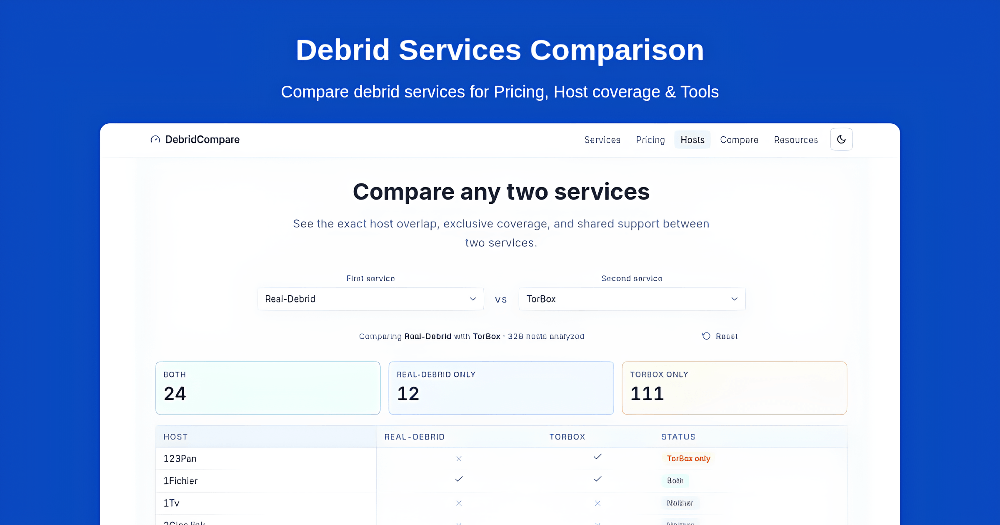
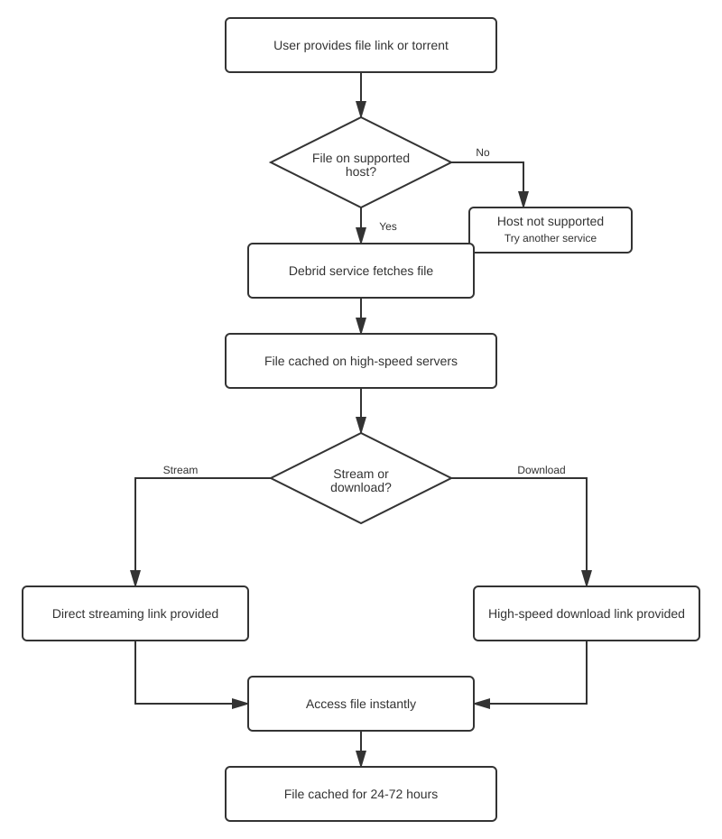

  <h1>⚡ Debrid Services Comparison</h1>

  
Compare various debrid services across 300+ file hosts, pricing, policies, and tools.

  

    
      
    
    
    
  

  

 

**[Open the tool](https://debridcompare.pages.dev/) | [Choose a service](#choosing-the-right-service) | [Pricing](#pricing-comparison)
| [Search hosts](#available-hosts) | [Tools & Apps](#tools-and-applications) | [FAQ](#faq)**

 

## Table of Contents

👉 Click to expand

- [What are Debrid Services?](#what-are-debrid-services)
  - [Key Benefits](#key-benefits)
  - [How It Works](#how-it-works)
- [Choosing the Right Service](#choosing-the-right-service)
- [Quick Start Guide](#quick-start-guide)
- [Pricing Comparison](#pricing-comparison)
- [Available Hosts](#available-hosts)
  - [Complete Host List](#complete-host-list)
  - [Usenet Support](#usenet-support)
  - [Adult Hosts](#adult-hosts)
  - [Live Status](#live-status)
- [Policies](#policies)
- [Speed Test](#speed-test)
- [Tools and Applications](#tools-and-applications)
  - [🎬 Media Centers \& Streaming Apps](#-media-centers--streaming-apps)
  - [🔌 Streaming Add-ons](#-streaming-add-ons)
  - [📚 Media Management \& Automation](#-media-management--automation)
  - [📥 Download Managers](#-download-managers)
  - [🌐 Browser Extensions](#-browser-extensions)
  - [📱 Mobile Applications](#-mobile-applications)
- [Community Resources](#community-resources)
- [FAQ](#faq)
- [Disclaimer](#disclaimer)
- [Contributing](#contributing)
- [Support This Project](#support-this-project)

## What are Debrid Services?

Debrid ("multi-hoster") services act as paid aggregation layers between you and dozens/hundreds of individual file hosts. You give them a link (or torrent/magnet) → where the provider supports the source, it may fetch the item or return a cached copy. Speed, cache status, ads, and host restrictions depend on the service, plan, host, and source.

### Key Benefits

- **Direct downloads** - supported links may avoid some host-side waits or CAPTCHAs; speeds and restrictions vary
- **One subscription** - access to hundreds of file hosts
- **Remote torrent/magnet fetching** - retrieval is handled by the provider; privacy, seeding, and retention depend on its terms and plan
- **Streaming-ready links** - compatible with media servers and apps
- **Cloud storage and caching** - available space and retention vary by provider and plan
- **API access** - automation and third-party integrations

### How It Works

 

  

 

> [!TIP]
> Think of debrid services as a **premium bridge** between you and file-hosting sites. A matching cached item may be available quickly, but speed and availability depend on the provider, plan, source, and cache state.

---

## Choosing the Right Service

### Core Features Matrix

| Feature | Real-Debrid | AllDebrid | Premiumize | TorBox | Debrid-Link | LinkSnappy | Others |
|:--------|:-----------:|:---------:|:----------:|:------:|:-----------:|:----------:|:------:|
| **Torrent Support** | ✅ | ✅ | ✅ | ✅ | ✅ | ❌ | ✅ |
| **Usenet Access** | ❌ | ❌ | ✅ | ✅ | ❌ | ❌ | Platform Dependent |
| **Free Trial/Tier** | ❌ | ✅   (7-day) | ❌ | ✅ | ❌ | ❌ | Varies |
| **API Access** | ✅ | ✅ | ✅ | ✅ | ✅ | ✅ | ✅ |
| **Mobile Apps** | 3rd-party | PWA | Official | Official | Web | Web | Varies |
| **Cloud Storage** | Temp cache | Temp cache | Yes | Yes | Temp cache | Temp cache | Varies |

 

### 📌 Quick Decision Matrix:

| Your Priority | Recommended Service | See Details |
|:-------------|:-------------------|:-----------|
|**🏆 Best Overall / Stremio + Kodi** | **Premiumize** | [→ Pricing](#pricing-comparison) |
|**Lowest Price** | AllDebrid | [→ Pricing](#pricing-comparison) |
|**Usenet + Torrents** | Premiumize / TorBox Pro | [→ Usenet support](#usenet-support) |
|**Try Before Buy** | AllDebrid (7-day, SMS-verified trial) / TorBox free tier | [→ Pricing](#pricing-comparison) |
|**Maximum Hosts** | LinkSnappy | [→ File Hosts](#available-hosts) |
|**Plex/Jellyfin Setup** | Premiumize | [→ Media Tools](#tools-and-applications) |
|**Legacy Cache / Niche Content** | Real-Debrid ⚠️ | [→ RD Warning](#real-debrid-2026-changes) |

> [!WARNING]
> **TorBox:** Its Terms changed to prohibit account/API-key sharing, and the service has had multiple downtime incidents. Review the current [Terms](https://torbox.app/policies/terms) and [status page](https://status.torbox.app/) before subscribing or renewing.

<strong>🤔 Still not sure? Click here for personalized recommendations</strong>

 

**Choose Premiumize if:**
- ✅ You want the published 1 TB cloud-storage plan with WebDAV, FTP, SFTP, remote upload, and API access
- ✅ You prefer a one-year plan; the official page lists €69.99 / US$79.99 (VAT may apply)
- ✅ You use Usenet alongside torrents

**Choose AllDebrid if:**
- ✅ You want a 30-day recurring plan listed at €2.99 or a one-time 30-day plan at €3.99
- ✅ You want to try the 7-day free offer (SMS verification; new members; fair-use limits apply)

**Choose LinkSnappy if:**
- ✅ You need support for obscure file hosts
- ✅ Maximum host coverage is critical
- ✅ You download from many different sources

**Choose Real-Debrid if (⚠️ with caution):**
- ✅ You need legacy cache depth for older/niche content
- ✅ You're already subscribed and some 1080p content still works
- ❌ **Not recommended** as a primary service - copyright filtering blocks 50-70% of cached content as of June 2026

 

> [!TIP]
> **Still deciding?** Check our **[File Hosts](#available-hosts)** reference or [compare services in the web tool](https://debridcompare.pages.dev/).

[(↑ Back to Top)](#table-of-contents)

---

## Quick Start Guide

### 3 Simple Steps to Get Started

#### 1. **Choose a Service**:
 - Not sure? See **[Choosing the Right Service](#choosing-the-right-service)** for personalized recommendations
 - Compare **[Pricing](#pricing-comparison)** and **[Host Support](#available-hosts)**

#### 2. **Sign Up & Configure**:
 - Create an account, activate your subscription, and get your API key for tool integrations
 - Activation time and payment methods vary; check the provider’s current checkout and terms

#### 3. **Start Using**:
 - Add links/torrents via web interface, install **[browser extensions](#-browser-extensions)**, or integrate with **[media tools](#tools-and-applications)**
 - A matching cached item may be available quickly; uncached requests and streaming support vary by service and source

> [!TIP]
> **First time?** Try the free options ([TorBox](#pricing-comparison), [AllDebrid trial](#pricing-comparison)) or start with a short-term plan. Check the provider’s current limits, terms, and price before purchase.

[(↑ Back to Top)](#table-of-contents)

---

## Pricing Comparison

> [!TIP]
> Check provider pricing pages before purchase; VAT and other fees may apply.

### Price Comparison Table

| **Plan Duration** | **AllDebrid** | **Premiumize** | **Real-Debrid** | **TorBox** | **Debrid-Link** | **LinkSnappy** | **Mega-Debrid** | **Deepbrid** | **High-Way** |
| :--- | :--- | :--- | :--- | :--- | :--- | :--- | :--- | :--- | :--- |
| **Free / Trial** | [7-day trial¹](#footnote-1) | ❌ | - | [Free tier²](#footnote-2) | ❌ | ❌ | ❌ | Limited hosts only | [Limited Hosts³](#footnote-3) |
| **7 Days** | ❌ | ❌ | - | - | ❌ | $4.99 USD | ❌ | ❌ | ❌ |
| **14 Days** | - | - | - | - | - | - | - | [€4.50](https://www.deepbrid.com/signup) | - |
| **15 Days** | [€2.99 (one-time)⁴](#footnote-4) | ❌ | €3.00 | - | €3.00 | ❌ | ❌ | - | ❌ |
| **30 Days** | €2.99 recurring / [€3.99 one-time⁴](#footnote-4) | €9.99 / US$11.99 | €4.00 | Essential $3 / Standard $5 / Pro $10 | €4.00 | $12.99 USD | €4.00 | €4.99 | Premium €5.99 / Unlimited €9.99[⁵](#footnote-5) |
| **90 Days** | [€8.99 (one-time)⁴](#footnote-4) | - | €9.00 | - | €9.00 | $29.99 USD | €9.00 | €12.99 | Premium €15.99 / Unlimited €24.99[⁵](#footnote-5) |
| **180 Days** | [€15.99 (one-time)⁴](#footnote-4) | - | €16.00 | - | €16.00 | $54.99 USD | €16.00 | €19.99 | Premium €29.99 / Unlimited €44.99[⁵](#footnote-5) |
| **300 Days** | [€24.99 (one-time)⁴](#footnote-4) | - | - | - | €25.00 | ❌ | ❌ | ❌ | ❌ |
| **365 Days / 1 Year** | ❌ | €69.99 / US$79.99 (€5.75 / US$6.57 per month) | - | - | ❌ | ❌ | ❌ | €32.99 | Premium €47.99 / Unlimited €71.99[⁵](#footnote-5) |

> [!NOTE]
> - **¹ AllDebrid Free Tryout**: 7 days, SMS verification, new members only, subject to fair-use limits. [Official offer →](https://alldebrid.com/offer/)
> - **² TorBox Free Tier**: The official page lists 1 concurrent slot, 10 downloads/month, a 10GB maximum download size, and 250Mbps. See current limits on [TorBox pricing](https://torbox.app/pricing).
> - **³ High-Way free access**: Limited hoster access and free MB through forum activity. [Verify details →](https://high-way.me/pages/tariffs/)
> - **⁴ AllDebrid one-time plans**: These plans are non-recurring; the recurring 30-day plan is separate. [Official offer →](https://alldebrid.com/offer/)
> - **⁵ High-Way packages**: The table shows the lowest listed 250GB/month packages. Larger volume packages cost more. [Premium packages](https://high-way.me/choosep.php) · [Unlimited packages](https://high-way.me/chooseu.php)
>
> **Price legend:** A dash (-) means no price is listed for that term. Confirm current offers before purchase.

### Up-to-date Pricing

> [!TIP]  
> *Always verify prices on official sites as they change frequently.*

👉 Click to expand

| **Service** | **Official Pricing Page**                                                  |
| :---------- | :------------------------------------------------------------------------- |
| AllDebrid   | [alldebrid.com/offer](https://alldebrid.com/offer/)                        |
| Real-Debrid | [real-debrid.com/premium](https://real-debrid.com/premium)                 |
| TorBox      | [torbox.app/pricing](https://torbox.app/pricing)                           |
| Premiumize  | [premiumize.me/premium](https://www.premiumize.me/premium)                 |
| LinkSnappy  | [Official FAQ / pricing](https://linksnappy.com/index.php?act=faqs) |
| Debrid-Link | [debrid-link.com/premium](https://debrid-link.com/premium)                 |
| Mega-Debrid | [mega-debrid.eu/offres](https://www.mega-debrid.eu/index.php?page=offres)  |
| Deepbrid    | [Official homepage / pricing](https://www.deepbrid.com/home)                |
| High-Way    | [Official tariffs](https://high-way.me/pages/tariffs/)                     |

 

 

[(↑ Back to Top)](#table-of-contents)

---

## Available Hosts

> **💡 Pro Tip:** Use the [**interactive web app**](https://debridcompare.pages.dev) for advanced search, filters, and side-by-side comparison!

 

> [!WARNING]
> Real-Debrid has started returning copyright-infringement errors on many cached torrents. Read more on: [Torrent Freak](https://torrentfreak.com/real-debrids-renewed-piracy-crackdown-follows-corporate-restructuring/) 

> [!NOTE]
> Even though Rapidgator is listed as a supported file hoster for Torbox, it is constantly "Offline". For more details visit this [Issue](https://github.com/fynks/debrid-services-comparison/issues/34)

### Complete Host List

Comprehensive list of all supported file hosts across all services.

<strong>👉 Click to expand complete host list</strong>
 

| **Service Name** | **Deepbrid** | **Debrid-Link** | **High-Way** | **LinkSnappy** | **Mega-Debrid** | **Premiumize** | **AllDebrid** | **TorBox** |
| :--- | :--- | :--- | :--- | :--- | :--- | :--- | :--- | :--- |
| 1Fichier | ✅ | ✅ | ✅ | ✅ | ✅ | ✅ | ✅ | ✅ |
| 1Tv | ❌ | ❌ | ❌ | ❌ | ✅ | ❌ | ❌ | ❌ |
| 2Giga.link | ❌ | ❌ | ❌ | ❌ | ✅ | ❌ | ❌ | ❌ |
| 4Chan | ❌ | ❌ | ❌ | ❌ | ❌ | ❌ | ❌ | ✅ |
| 4Funbox | ✅ | ❌ | ❌ | ❌ | ❌ | ❌ | ❌ | ❌ |
| 4Shared | ✅ | ❌ | ❌ | ❌ | ❌ | ❌ | ✅ | ✅ |
| 4Tube | ❌ | ❌ | ❌ | ❌ | ❌ | ❌ | ❌ | ❌ |
| 123Pan | ❌ | ❌ | ❌ | ❌ | ❌ | ❌ | ❌ | ✅ |
| Abcnews | ❌ | ❌ | ❌ | ❌ | ✅ | ❌ | ❌ | ✅ |
| Acast | ❌ | ❌ | ❌ | ❌ | ✅ | ❌ | ❌ | ✅ |
| Alfafile | ✅ | ❌ | ❌ | ❌ | ✅ | ❌ | ✅ | ✅ |
| Annas archive | ❌ | ❌ | ❌ | ❌ | ❌ | ❌ | ❌ | ✅ |
| Anonfiles | ❌ | ❌ | ❌ | ❌ | ✅ | ❌ | ❌ | ❌ |
| Aparat | ❌ | ❌ | ❌ | ❌ | ✅ | ❌ | ❌ | ✅ |
| Apkadmin | ❌ | ❌ | ❌ | ❌ | ❌ | ❌ | ❌ | ✅ |
| Archive.org | ❌ | ❌ | ❌ | ❌ | ✅ | ✅ | ❌ | ✅ |
| Audioboom | ❌ | ❌ | ❌ | ❌ | ✅ | ❌ | ❌ | ✅ |
| Audiomack | ❌ | ❌ | ❌ | ❌ | ✅ | ❌ | ❌ | ✅ |
| Baidu video | ❌ | ❌ | ❌ | ❌ | ❌ | ❌ | ❌ | ✅ |
| Bayfiles | ✅ | ❌ | ❌ | ❌ | ❌ | ❌ | ❌ | ❌ |
| Bbc | ❌ | ❌ | ❌ | ❌ | ❌ | ❌ | ❌ | ✅ |
| Beta hoster | ❌ | ❌ | ✅ | ❌ | ❌ | ❌ | ❌ | ❌ |
| Bilibili | ❌ | ❌ | ❌ | ❌ | ❌ | ❌ | ❌ | ✅ |
| Bluesky | ❌ | ❌ | ❌ | ❌ | ❌ | ❌ | ❌ | ✅ |
| Brupload | ❌ | ❌ | ❌ | ❌ | ❌ | ❌ | ❌ | ❌ |
| Buenastareas | ✅ | ❌ | ❌ | ❌ | ❌ | ❌ | ❌ | ❌ |
| Bunkr | ❌ | ❌ | ❌ | ❌ | ❌ | ❌ | ❌ | ✅ |
| Buzzheavier | ❌ | ❌ | ❌ | ❌ | ❌ | ❌ | ❌ | ✅ |
| Calameo | ✅ | ❌ | ❌ | ❌ | ✅ | ❌ | ❌ | ❌ |
| Camdemy | ❌ | ❌ | ❌ | ❌ | ✅ | ❌ | ❌ | ✅ |
| Canalplus | ❌ | ❌ | ❌ | ❌ | ❌ | ❌ | ❌ | ❌ |
| Castbox | ❌ | ❌ | ❌ | ❌ | ❌ | ❌ | ❌ | ✅ |
| Catbox | ❌ | ❌ | ❌ | ❌ | ❌ | ❌ | ❌ | ✅ |
| Cc.com | ❌ | ❌ | ❌ | ❌ | ✅ | ❌ | ❌ | ❌ |
| Chilloutzone | ❌ | ❌ | ❌ | ❌ | ✅ | ❌ | ❌ | ✅ |
| Cinemassacre | ❌ | ❌ | ❌ | ❌ | ✅ | ❌ | ❌ | ❌ |
| Clicknupload | ✅ | ✅ | ❌ | ❌ | ❌ | ✅ | ❌ | ✅ |
| Clipfish | ❌ | ❌ | ❌ | ❌ | ✅ | ❌ | ❌ | ❌ |
| Clipsyndicate | ❌ | ❌ | ❌ | ❌ | ✅ | ❌ | ❌ | ❌ |
| Cloudvideo | ❌ | ❌ | ❌ | ❌ | ❌ | ✅ | ❌ | ❌ |
| Clubic | ❌ | ❌ | ❌ | ❌ | ✅ | ❌ | ❌ | ❌ |
| Collegehumor | ❌ | ❌ | ❌ | ❌ | ✅ | ❌ | ❌ | ❌ |
| Comedy central | ❌ | ❌ | ❌ | ❌ | ❌ | ❌ | ❌ | ✅ |
| Coomer | ❌ | ❌ | ❌ | ❌ | ❌ | ❌ | ❌ | ❌ |
| Cyberdrop | ❌ | ❌ | ❌ | ❌ | ❌ | ❌ | ❌ | ❌ |
| Daclips | ❌ | ❌ | ❌ | ❌ | ✅ | ❌ | ❌ | ❌ |
| Dagbladet | ❌ | ❌ | ❌ | ❌ | ✅ | ❌ | ❌ | ❌ |
| Dailymail | ❌ | ❌ | ❌ | ❌ | ✅ | ❌ | ❌ | ✅ |
| Dailymotion | ✅ | ❌ | ❌ | ❌ | ❌ | ❌ | ❌ | ✅ |
| Dailyuploads | ✅ | ✅ | ❌ | ❌ | ✅ | ❌ | ❌ | ✅ |
| Darkibox | ❌ | ❌ | ❌ | ❌ | ❌ | ❌ | ❌ | ❌ |
| Data nodes | ❌ | ❌ | ❌ | ❌ | ❌ | ❌ | ❌ | ✅ |
| Datafilehost | ❌ | ❌ | ❌ | ❌ | ✅ | ❌ | ❌ | ❌ |
| Datavaults | ❌ | ❌ | ❌ | ❌ | ❌ | ❌ | ❌ | ✅ |
| Dctp | ❌ | ❌ | ❌ | ❌ | ✅ | ❌ | ❌ | ✅ |
| Ddl | ✅ | ❌ | ❌ | ❌ | ❌ | ❌ | ❌ | ❌ |
| Ddl.to | ❌ | ❌ | ❌ | ✅ | ❌ | ❌ | ❌ | ❌ |
| Ddownload | ✅ | ✅ | ❌ | ❌ | ✅ | ❌ | ❌ | ✅ |
| Ddownload / ddl.to | ❌ | ❌ | ❌ | ❌ | ❌ | ❌ | ❌ | ❌ |
| Depositfiles | ✅ | ❌ | ❌ | ❌ | ❌ | ❌ | ❌ | ❌ |
| Deviantart | ❌ | ❌ | ❌ | ❌ | ❌ | ❌ | ❌ | ✅ |
| Dfiles | ✅ | ❌ | ❌ | ❌ | ❌ | ❌ | ❌ | ❌ |
| Discord | ❌ | ❌ | ❌ | ❌ | ❌ | ❌ | ❌ | ✅ |
| Discovery channel | ❌ | ❌ | ❌ | ❌ | ✅ | ❌ | ❌ | ❌ |
| Dotsub | ❌ | ❌ | ❌ | ❌ | ✅ | ❌ | ❌ | ❌ |
| Driveseed | ❌ | ❌ | ❌ | ❌ | ❌ | ❌ | ❌ | ✅ |
| Drop | ✅ | ❌ | ❌ | ❌ | ❌ | ❌ | ❌ | ❌ |
| Drop.download | ❌ | ✅ | ✅ | ❌ | ✅ | ✅ | ❌ | ❌ |
| Dropapk | ✅ | ❌ | ❌ | ❌ | ❌ | ❌ | ❌ | ✅ |
| Dropbox | ❌ | ✅ | ❌ | ❌ | ❌ | ❌ | ❌ | ✅ |
| Dropgalaxy | ❌ | ❌ | ❌ | ❌ | ❌ | ❌ | ❌ | ❌ |
| Dropmefiles | ❌ | ❌ | ❌ | ❌ | ✅ | ❌ | ❌ | ❌ |
| Drtuber | ❌ | ❌ | ❌ | ❌ | ❌ | ❌ | ❌ | ❌ |
| Easybytez | ✅ | ❌ | ❌ | ❌ | ❌ | ❌ | ❌ | ❌ |
| Ebaumsworld | ❌ | ❌ | ❌ | ❌ | ✅ | ❌ | ❌ | ✅ |
| Elitefile | ❌ | ✅ | ❌ | ❌ | ❌ | ❌ | ❌ | ❌ |
| Ellentv | ❌ | ❌ | ❌ | ❌ | ✅ | ❌ | ❌ | ❌ |
| Emload | ✅ | ✅ | ❌ | ❌ | ❌ | ❌ | ❌ | ❌ |
| Exload | ❌ | ❌ | ❌ | ❌ | ❌ | ❌ | ✅ | ❌ |
| Extmatrix | ✅ | ❌ | ❌ | ❌ | ❌ | ❌ | ❌ | ✅ |
| Facebook | ❌ | ❌ | ❌ | ❌ | ❌ | ❌ | ❌ | ✅ |
| Fansly | ❌ | ❌ | ❌ | ❌ | ❌ | ❌ | ❌ | ❌ |
| Fastbit | ❌ | ❌ | ❌ | ❌ | ❌ | ❌ | ✅ | ❌ |
| Fastfile | ✅ | ❌ | ❌ | ❌ | ❌ | ❌ | ❌ | ❌ |
| Fikper | ❌ | ✅ | ❌ | ❌ | ✅ | ❌ | ❌ | ❌ |
| File | ✅ | ❌ | ❌ | ❌ | ❌ | ❌ | ❌ | ❌ |
| File.al | ❌ | ✅ | ❌ | ❌ | ❌ | ✅ | ❌ | ❌ |
| File4safe | ✅ | ❌ | ❌ | ❌ | ❌ | ❌ | ❌ | ❌ |
| Fileal | ❌ | ❌ | ❌ | ❌ | ❌ | ❌ | ✅ | ❌ |
| Fileaxa | ✅ | ✅ | ❌ | ❌ | ❌ | ❌ | ❌ | ❌ |
| Fileblade | ✅ | ❌ | ❌ | ❌ | ❌ | ❌ | ❌ | ❌ |
| Filecat | ✅ | ✅ | ❌ | ❌ | ❌ | ❌ | ❌ | ❌ |
| Filecrypt | ❌ | ❌ | ❌ | ❌ | ❌ | ❌ | ❌ | ✅ |
| Filedot | ❌ | ✅ | ❌ | ❌ | ❌ | ❌ | ✅ | ❌ |
| Filefactory | ✅ | ❌ | ✅ | ✅ | ✅ | ✅ | ❌ | ✅ |
| Filefox | ❌ | ❌ | ❌ | ❌ | ❌ | ❌ | ❌ | ❌ |
| Fileland | ❌ | ✅ | ❌ | ❌ | ❌ | ❌ | ❌ | ❌ |
| Filenext | ✅ | ❌ | ❌ | ❌ | ❌ | ✅ | ❌ | ❌ |
| Filepress | ❌ | ❌ | ❌ | ❌ | ❌ | ❌ | ❌ | ✅ |
| Fileq | ❌ | ❌ | ❌ | ❌ | ❌ | ❌ | ❌ | ✅ |
| Filer | ✅ | ❌ | ❌ | ✅ | ❌ | ❌ | ❌ | ✅ |
| Filer.net | ❌ | ✅ | ✅ | ❌ | ✅ | ❌ | ❌ | ❌ |
| Filerio | ❌ | ❌ | ❌ | ❌ | ❌ | ❌ | ✅ | ❌ |
| Files.vc | ❌ | ❌ | ❌ | ❌ | ❌ | ❌ | ❌ | ✅ |
| Filesfly | ❌ | ✅ | ❌ | ❌ | ❌ | ❌ | ❌ | ❌ |
| Filesmonster | ✅ | ❌ | ❌ | ❌ | ❌ | ❌ | ❌ | ❌ |
| Filespace | ✅ | ✅ | ❌ | ❌ | ❌ | ❌ | ✅ | ✅ |
| Filestank | ❌ | ❌ | ❌ | ❌ | ✅ | ❌ | ❌ | ❌ |
| Filestore | ✅ | ✅ | ✅ | ❌ | ✅ | ✅ | ❌ | ❌ |
| Filestore.me | ❌ | ❌ | ❌ | ❌ | ❌ | ❌ | ❌ | ✅ |
| Filextras | ✅ | ✅ | ❌ | ❌ | ❌ | ❌ | ❌ | ❌ |
| Filezip | ❌ | ❌ | ❌ | ❌ | ❌ | ❌ | ✅ | ❌ |
| Fireget | ✅ | ❌ | ❌ | ❌ | ❌ | ❌ | ❌ | ❌ |
| Flipagram | ❌ | ❌ | ❌ | ❌ | ✅ | ❌ | ❌ | ❌ |
| Flix555 | ❌ | ❌ | ❌ | ❌ | ✅ | ❌ | ❌ | ❌ |
| Formula1 | ❌ | ❌ | ❌ | ❌ | ✅ | ❌ | ❌ | ✅ |
| Foxnews | ❌ | ❌ | ❌ | ❌ | ✅ | ❌ | ❌ | ✅ |
| Free | ❌ | ❌ | ❌ | ❌ | ✅ | ❌ | ❌ | ❌ |
| Fuckingfast | ❌ | ❌ | ❌ | ❌ | ❌ | ❌ | ❌ | ❌ |
| Gamersyde | ❌ | ❌ | ❌ | ❌ | ✅ | ❌ | ❌ | ❌ |
| Gamestar | ❌ | ❌ | ❌ | ❌ | ✅ | ❌ | ❌ | ✅ |
| Gelbooru | ❌ | ❌ | ❌ | ❌ | ❌ | ❌ | ❌ | ❌ |
| Gigapeta | ✅ | ✅ | ❌ | ❌ | ❌ | ❌ | ✅ | ❌ |
| Github | ❌ | ❌ | ❌ | ❌ | ❌ | ❌ | ❌ | ✅ |
| Gofile | ✅ | ✅ | ❌ | ❌ | ❌ | ❌ | ❌ | ✅ |
| Google | ❌ | ❌ | ❌ | ❌ | ❌ | ✅ | ❌ | ❌ |
| Google drive | ❌ | ✅ | ❌ | ❌ | ❌ | ❌ | ❌ | ✅ |
| Gorillavid | ❌ | ❌ | ❌ | ❌ | ✅ | ❌ | ❌ | ❌ |
| Hexload | ✅ | ❌ | ❌ | ❌ | ❌ | ❌ | ❌ | ✅ |
| Hexupload | ❌ | ❌ | ❌ | ❌ | ❌ | ❌ | ✅ | ❌ |
| Hexupload / hexload | ❌ | ✅ | ❌ | ❌ | ❌ | ✅ | ❌ | ❌ |
| Hitfile | ✅ | ✅ | ❌ | ❌ | ✅ | ✅ | ✅ | ✅ |
| Hitomi | ❌ | ❌ | ❌ | ❌ | ❌ | ❌ | ❌ | ❌ |
| Hot4share | ✅ | ❌ | ❌ | ❌ | ❌ | ❌ | ✅ | ❌ |
| Hotlink | ✅ | ❌ | ❌ | ❌ | ✅ | ❌ | ❌ | ❌ |
| Hubcloud | ❌ | ❌ | ❌ | ❌ | ❌ | ❌ | ❌ | ✅ |
| Hubdrive | ❌ | ❌ | ❌ | ❌ | ❌ | ❌ | ❌ | ✅ |
| Hulkshare | ✅ | ✅ | ❌ | ❌ | ❌ | ❌ | ❌ | ❌ |
| Icerbox | ✅ | ❌ | ❌ | ❌ | ❌ | ❌ | ❌ | ❌ |
| Icloud drive | ❌ | ✅ | ❌ | ❌ | ❌ | ❌ | ❌ | ❌ |
| Idnes | ❌ | ❌ | ❌ | ❌ | ✅ | ❌ | ❌ | ✅ |
| Imgbb | ❌ | ❌ | ❌ | ❌ | ❌ | ❌ | ❌ | ✅ |
| Imgur | ❌ | ❌ | ❌ | ❌ | ❌ | ❌ | ❌ | ✅ |
| Indishare | ❌ | ❌ | ❌ | ❌ | ❌ | ❌ | ✅ | ❌ |
| Infrastructure | ❌ | ✅ | ❌ | ❌ | ❌ | ❌ | ❌ | ❌ |
| Instagram | ❌ | ❌ | ❌ | ❌ | ✅ | ❌ | ❌ | ✅ |
| Isra | ❌ | ❌ | ❌ | ❌ | ❌ | ❌ | ✅ | ❌ |
| Isra.cloud | ❌ | ✅ | ✅ | ✅ | ✅ | ✅ | ❌ | ❌ |
| Isracloud | ❌ | ❌ | ❌ | ❌ | ❌ | ❌ | ❌ | ✅ |
| Issuu | ✅ | ❌ | ❌ | ❌ | ✅ | ❌ | ❌ | ❌ |
| Izlesene | ❌ | ❌ | ❌ | ❌ | ✅ | ❌ | ❌ | ✅ |
| Jamendo | ❌ | ❌ | ❌ | ❌ | ✅ | ❌ | ❌ | ✅ |
| Jumploads | ✅ | ✅ | ❌ | ❌ | ❌ | ❌ | ❌ | ❌ |
| K2s | ✅ | ❌ | ❌ | ❌ | ❌ | ❌ | ❌ | ❌ |
| K2s (keep2share) | ❌ | ❌ | ✅ | ❌ | ❌ | ❌ | ❌ | ❌ |
| Karrierevideos | ❌ | ❌ | ❌ | ❌ | ✅ | ❌ | ❌ | ❌ |
| Katfile | ✅ | ✅ | ✅ | ❌ | ✅ | ✅ | ✅ | ✅ |
| Katfile.com | ❌ | ❌ | ❌ | ✅ | ❌ | ❌ | ❌ | ❌ |
| Keek | ❌ | ❌ | ❌ | ❌ | ✅ | ❌ | ❌ | ❌ |
| Keep2share | ✅ | ❌ | ❌ | ✅ | ❌ | ❌ | ❌ | ❌ |
| Kenfiles | ✅ | ❌ | ❌ | ❌ | ❌ | ❌ | ❌ | ❌ |
| Khanacademy | ❌ | ❌ | ❌ | ❌ | ✅ | ❌ | ❌ | ✅ |
| Kick | ❌ | ❌ | ❌ | ❌ | ❌ | ❌ | ❌ | ✅ |
| Kickstarter | ❌ | ❌ | ❌ | ❌ | ✅ | ❌ | ❌ | ✅ |
| Koofr | ❌ | ❌ | ❌ | ❌ | ❌ | ❌ | ❌ | ✅ |
| Krakenfiles | ✅ | ❌ | ❌ | ❌ | ❌ | ❌ | ❌ | ✅ |
| Kshared | ❌ | ✅ | ❌ | ❌ | ❌ | ❌ | ❌ | ❌ |
| Kvid | ❌ | ❌ | ❌ | ❌ | ✅ | ❌ | ❌ | ❌ |
| Lcp | ❌ | ❌ | ❌ | ❌ | ✅ | ❌ | ❌ | ✅ |
| Liveleak | ❌ | ❌ | ❌ | ❌ | ✅ | ❌ | ❌ | ❌ |
| Loom | ❌ | ❌ | ❌ | ❌ | ❌ | ❌ | ❌ | ✅ |
| Lynda | ❌ | ❌ | ❌ | ❌ | ❌ | ❌ | ❌ | ❌ |
| Mangadex | ❌ | ❌ | ❌ | ❌ | ❌ | ❌ | ❌ | ✅ |
| Mediaccc | ❌ | ❌ | ❌ | ❌ | ✅ | ❌ | ❌ | ❌ |
| Mediafire | ✅ | ✅ | ❌ | ✅ | ✅ | ✅ | ✅ | ✅ |
| Mega | ✅ | ✅ | ✅ | ✅ | ✅ | ✅ | ✅ | ✅ |
| Megadb | ❌ | ❌ | ❌ | ❌ | ❌ | ❌ | ❌ | ✅ |
| Megaup | ❌ | ❌ | ❌ | ❌ | ❌ | ❌ | ❌ | ✅ |
| Metacafe | ❌ | ❌ | ❌ | ❌ | ✅ | ❌ | ❌ | ❌ |
| Mexashare | ❌ | ✅ | ❌ | ❌ | ❌ | ❌ | ❌ | ❌ |
| Mirrobox | ✅ | ❌ | ❌ | ❌ | ❌ | ❌ | ❌ | ❌ |
| Mixcloud | ❌ | ❌ | ❌ | ❌ | ✅ | ❌ | ❌ | ❌ |
| Mixdrop | ❌ | ✅ | ❌ | ❌ | ❌ | ❌ | ✅ | ✅ |
| Modsbase | ❌ | ❌ | ❌ | ❌ | ❌ | ✅ | ✅ | ❌ |
| Movieclips | ❌ | ❌ | ❌ | ❌ | ✅ | ❌ | ❌ | ❌ |
| Movpod | ❌ | ❌ | ❌ | ❌ | ✅ | ❌ | ❌ | ❌ |
| Mp4upload | ❌ | ❌ | ❌ | ❌ | ❌ | ❌ | ✅ | ❌ |
| Msnbc | ❌ | ❌ | ❌ | ❌ | ✅ | ❌ | ❌ | ❌ |
| Myspass | ❌ | ❌ | ❌ | ❌ | ✅ | ❌ | ❌ | ❌ |
| Nbcsports | ❌ | ❌ | ❌ | ❌ | ✅ | ❌ | ❌ | ✅ |
| Ndtv | ❌ | ❌ | ❌ | ❌ | ✅ | ❌ | ❌ | ❌ |
| Nelion | ❌ | ✅ | ❌ | ❌ | ❌ | ❌ | ❌ | ❌ |
| Nexusmods | ❌ | ❌ | ❌ | ❌ | ❌ | ❌ | ❌ | ✅ |
| Nfl | ❌ | ❌ | ❌ | ❌ | ✅ | ❌ | ❌ | ✅ |
| Niconico | ❌ | ❌ | ❌ | ❌ | ❌ | ❌ | ❌ | ✅ |
| Nitroflare | ✅ | ❌ | ✅ | ❌ | ❌ | ❌ | ❌ | ✅ |
| Nytimes | ❌ | ❌ | ❌ | ❌ | ❌ | ✅ | ❌ | ✅ |
| Oboom | ✅ | ❌ | ❌ | ❌ | ❌ | ❌ | ❌ | ❌ |
| Odatv | ❌ | ❌ | ❌ | ❌ | ✅ | ❌ | ❌ | ❌ |
| Odnoklassniki | ❌ | ❌ | ❌ | ❌ | ❌ | ❌ | ❌ | ✅ |
| Ok.ru | ❌ | ❌ | ❌ | ❌ | ✅ | ❌ | ❌ | ❌ |
| Onionstudios | ❌ | ❌ | ❌ | ❌ | ✅ | ❌ | ❌ | ❌ |
| Pan baidu | ❌ | ❌ | ❌ | ❌ | ❌ | ❌ | ❌ | ✅ |
| Panopto | ❌ | ❌ | ❌ | ❌ | ❌ | ❌ | ❌ | ✅ |
| Pikpak | ❌ | ❌ | ❌ | ❌ | ❌ | ❌ | ❌ | ✅ |
| Pillowcase | ❌ | ❌ | ❌ | ❌ | ❌ | ❌ | ❌ | ✅ |
| Pinkbike | ❌ | ❌ | ❌ | ❌ | ✅ | ❌ | ❌ | ❌ |
| Pinterest | ❌ | ❌ | ❌ | ❌ | ❌ | ❌ | ❌ | ✅ |
| Piwi+ | ❌ | ❌ | ❌ | ❌ | ✅ | ❌ | ❌ | ❌ |
| Pixeldrain | ❌ | ✅ | ❌ | ❌ | ✅ | ❌ | ❌ | ✅ |
| Plays | ❌ | ❌ | ❌ | ❌ | ✅ | ❌ | ❌ | ❌ |
| Playtvak | ❌ | ❌ | ❌ | ❌ | ✅ | ❌ | ❌ | ❌ |
| Prefiles | ✅ | ✅ | ❌ | ❌ | ❌ | ❌ | ✅ | ❌ |
| Pyvideo | ❌ | ❌ | ❌ | ❌ | ✅ | ❌ | ❌ | ❌ |
| Qiwi | ❌ | ❌ | ❌ | ❌ | ❌ | ❌ | ❌ | ✅ |
| Radiotunes | ✅ | ❌ | ❌ | ❌ | ❌ | ❌ | ❌ | ❌ |
| Rapidgator | ✅ | ✅ | ✅ | ✅ | ✅ | ✅ | ✅ | ✅ |
| Rapidrar | ✅ | ❌ | ❌ | ❌ | ❌ | ❌ | ❌ | ✅ |
| Reddit | ❌ | ❌ | ❌ | ❌ | ❌ | ❌ | ❌ | ✅ |
| Revision3 | ❌ | ❌ | ❌ | ❌ | ✅ | ❌ | ❌ | ❌ |
| Rg | ✅ | ❌ | ❌ | ❌ | ❌ | ❌ | ❌ | ❌ |
| Rosefile | ❌ | ❌ | ❌ | ❌ | ❌ | ❌ | ❌ | ❌ |
| Rtbf | ❌ | ❌ | ❌ | ❌ | ❌ | ❌ | ❌ | ❌ |
| Rte | ❌ | ❌ | ❌ | ❌ | ✅ | ❌ | ❌ | ❌ |
| Rts | ❌ | ❌ | ❌ | ❌ | ❌ | ❌ | ❌ | ❌ |
| Rtve.es | ❌ | ❌ | ❌ | ❌ | ❌ | ✅ | ❌ | ❌ |
| Ruhd | ❌ | ❌ | ❌ | ❌ | ✅ | ❌ | ❌ | ❌ |
| Rutube | ✅ | ❌ | ❌ | ❌ | ❌ | ❌ | ❌ | ✅ |
| Ruutu | ❌ | ❌ | ❌ | ❌ | ✅ | ❌ | ❌ | ❌ |
| Safedock | ✅ | ❌ | ❌ | ❌ | ❌ | ❌ | ❌ | ❌ |
| Salefiles | ✅ | ❌ | ❌ | ❌ | ❌ | ❌ | ❌ | ❌ |
| Scribd | ✅ | ✅ | ❌ | ❌ | ❌ | ❌ | ✅ | ✅ |
| Send | ❌ | ❌ | ❌ | ❌ | ❌ | ❌ | ❌ | ✅ |
| Send.cm / send.now | ❌ | ❌ | ❌ | ❌ | ❌ | ❌ | ❌ | ❌ |
| Sendit | ❌ | ❌ | ❌ | ❌ | ❌ | ❌ | ✅ | ❌ |
| Sendspace | ✅ | ❌ | ❌ | ❌ | ❌ | ❌ | ❌ | ✅ |
| Servers | ❌ | ✅ | ❌ | ❌ | ❌ | ❌ | ❌ | ❌ |
| Sharemods | ❌ | ❌ | ❌ | ❌ | ❌ | ❌ | ❌ | ✅ |
| Silkfiles | ❌ | ✅ | ❌ | ❌ | ❌ | ❌ | ❌ | ❌ |
| Simfileshare | ❌ | ❌ | ❌ | ❌ | ✅ | ❌ | ✅ | ❌ |
| Slideshare | ✅ | ❌ | ❌ | ❌ | ❌ | ❌ | ❌ | ❌ |
| Smotri | ❌ | ❌ | ❌ | ❌ | ✅ | ❌ | ❌ | ❌ |
| Snagfilms | ❌ | ❌ | ❌ | ❌ | ✅ | ❌ | ❌ | ❌ |
| Snapchat | ❌ | ❌ | ❌ | ❌ | ❌ | ❌ | ❌ | ✅ |
| Snotr | ❌ | ❌ | ❌ | ❌ | ✅ | ❌ | ❌ | ❌ |
| Solidfiles | ✅ | ❌ | ❌ | ❌ | ❌ | ❌ | ❌ | ❌ |
| Soundcloud | ✅ | ✅ | ❌ | ❌ | ❌ | ✅ | ❌ | ✅ |
| Sportdeutschland | ❌ | ❌ | ❌ | ❌ | ✅ | ❌ | ❌ | ❌ |
| Steam | ❌ | ❌ | ❌ | ❌ | ✅ | ❌ | ❌ | ❌ |
| Steam (video) | ❌ | ❌ | ❌ | ❌ | ❌ | ❌ | ❌ | ✅ |
| Stream.cz | ❌ | ❌ | ❌ | ❌ | ✅ | ❌ | ❌ | ❌ |
| Streamable | ❌ | ❌ | ❌ | ❌ | ✅ | ❌ | ❌ | ✅ |
| Streamcloud | ❌ | ❌ | ❌ | ❌ | ✅ | ❌ | ❌ | ❌ |
| Streamtape | ❌ | ❌ | ❌ | ❌ | ✅ | ✅ | ❌ | ✅ |
| Subyshare | ✅ | ❌ | ❌ | ❌ | ❌ | ❌ | ❌ | ❌ |
| Swisstransfer | ❌ | ❌ | ❌ | ❌ | ❌ | ❌ | ❌ | ✅ |
| Swrmediathek | ❌ | ❌ | ❌ | ❌ | ✅ | ❌ | ❌ | ❌ |
| Syncs | ✅ | ❌ | ❌ | ❌ | ❌ | ❌ | ❌ | ❌ |
| Sztv | ❌ | ❌ | ❌ | ❌ | ✅ | ❌ | ❌ | ❌ |
| Takefile | ✅ | ❌ | ❌ | ❌ | ❌ | ❌ | ❌ | ❌ |
| Teachertube | ❌ | ❌ | ❌ | ❌ | ✅ | ❌ | ❌ | ❌ |
| Teachingchannel | ❌ | ❌ | ❌ | ❌ | ✅ | ❌ | ❌ | ❌ |
| Teamfourstar | ❌ | ❌ | ❌ | ❌ | ✅ | ❌ | ❌ | ❌ |
| Techtalks | ❌ | ❌ | ❌ | ❌ | ✅ | ❌ | ❌ | ❌ |
| Ted | ❌ | ❌ | ❌ | ❌ | ✅ | ❌ | ❌ | ❌ |
| Telebruxelles | ❌ | ❌ | ❌ | ❌ | ✅ | ❌ | ❌ | ❌ |
| Telegram | ❌ | ❌ | ❌ | ❌ | ❌ | ❌ | ❌ | ✅ |
| Terabox | ✅ | ✅ | ❌ | ❌ | ❌ | ❌ | ❌ | ✅ |
| Terabytez | ✅ | ✅ | ❌ | ❌ | ❌ | ❌ | ❌ | ✅ |
| Tezfiles | ❌ | ✅ | ❌ | ❌ | ❌ | ❌ | ❌ | ❌ |
| Tiktok | ❌ | ❌ | ❌ | ❌ | ❌ | ❌ | ❌ | ✅ |
| Tlc | ❌ | ❌ | ❌ | ❌ | ❌ | ❌ | ❌ | ✅ |
| Transfer.it | ❌ | ❌ | ❌ | ❌ | ❌ | ❌ | ❌ | ✅ |
| Transfernow | ❌ | ❌ | ❌ | ❌ | ❌ | ❌ | ❌ | ✅ |
| Transfert.free | ✅ | ❌ | ❌ | ❌ | ❌ | ❌ | ❌ | ❌ |
| Trilulilu | ❌ | ❌ | ❌ | ❌ | ✅ | ❌ | ❌ | ❌ |
| Tubitv | ❌ | ❌ | ❌ | ❌ | ✅ | ❌ | ❌ | ❌ |
| Tumblr | ❌ | ❌ | ❌ | ❌ | ❌ | ❌ | ❌ | ✅ |
| Turbobit | ✅ | ✅ | ✅ | ✅ | ✅ | ✅ | ✅ | ✅ |
| Tusfiles | ✅ | ❌ | ❌ | ❌ | ❌ | ❌ | ❌ | ❌ |
| Tv4 | ❌ | ❌ | ❌ | ❌ | ✅ | ❌ | ❌ | ❌ |
| Tweakers | ❌ | ❌ | ❌ | ❌ | ✅ | ❌ | ❌ | ❌ |
| Twitch | ❌ | ❌ | ❌ | ❌ | ✅ | ❌ | ❌ | ✅ |
| Twitter | ❌ | ❌ | ❌ | ❌ | ❌ | ❌ | ❌ | ✅ |
| Up4ever | ❌ | ❌ | ❌ | ❌ | ❌ | ❌ | ❌ | ✅ |
| Upload42 | ❌ | ❌ | ❌ | ❌ | ❌ | ❌ | ✅ | ❌ |
| Uploadbank | ❌ | ❌ | ❌ | ❌ | ❌ | ❌ | ✅ | ❌ |
| Uploadbox | ❌ | ❌ | ❌ | ❌ | ❌ | ❌ | ✅ | ❌ |
| Uploadboy | ✅ | ❌ | ❌ | ❌ | ❌ | ✅ | ❌ | ❌ |
| Uploadgig | ✅ | ❌ | ❌ | ❌ | ❌ | ❌ | ❌ | ❌ |
| Uploadhaven | ✅ | ❌ | ❌ | ❌ | ❌ | ❌ | ❌ | ✅ |
| Uploadrar | ❌ | ❌ | ❌ | ❌ | ❌ | ✅ | ✅ | ❌ |
| Uploady | ❌ | ✅ | ❌ | ❌ | ✅ | ❌ | ❌ | ✅ |
| Uptobox | ✅ | ❌ | ❌ | ❌ | ❌ | ❌ | ❌ | ❌ |
| Upvid | ❌ | ✅ | ❌ | ❌ | ❌ | ❌ | ❌ | ❌ |
| Uqload | ❌ | ✅ | ❌ | ❌ | ❌ | ❌ | ❌ | ❌ |
| Userscloud | ✅ | ❌ | ❌ | ❌ | ❌ | ❌ | ❌ | ❌ |
| Usersdrive | ❌ | ✅ | ❌ | ❌ | ❌ | ✅ | ✅ | ❌ |
| Ustream | ❌ | ❌ | ❌ | ❌ | ✅ | ❌ | ❌ | ❌ |
| Veoh | ❌ | ❌ | ❌ | ❌ | ❌ | ✅ | ❌ | ❌ |
| Verystream | ❌ | ❌ | ❌ | ❌ | ✅ | ❌ | ❌ | ❌ |
| Vev | ❌ | ❌ | ❌ | ❌ | ✅ | ❌ | ❌ | ❌ |
| Vidabc | ❌ | ❌ | ❌ | ❌ | ✅ | ❌ | ❌ | ❌ |
| Videodetective | ❌ | ❌ | ❌ | ❌ | ✅ | ❌ | ❌ | ❌ |
| Vidoza | ✅ | ✅ | ❌ | ❌ | ✅ | ✅ | ❌ | ❌ |
| Vidspot | ❌ | ❌ | ❌ | ❌ | ✅ | ❌ | ❌ | ❌ |
| Vidto | ❌ | ❌ | ❌ | ❌ | ✅ | ❌ | ❌ | ❌ |
| Vidzi | ❌ | ❌ | ❌ | ❌ | ✅ | ❌ | ❌ | ❌ |
| Viking file | ❌ | ❌ | ❌ | ❌ | ❌ | ❌ | ❌ | ✅ |
| Vimeo | ✅ | ❌ | ❌ | ❌ | ❌ | ❌ | ❌ | ✅ |
| Vk | ❌ | ❌ | ❌ | ❌ | ❌ | ✅ | ❌ | ✅ |
| Vlive | ❌ | ❌ | ❌ | ❌ | ✅ | ❌ | ❌ | ❌ |
| Vodlocker | ❌ | ❌ | ❌ | ❌ | ✅ | ❌ | ❌ | ❌ |
| Voe | ❌ | ❌ | ❌ | ❌ | ❌ | ❌ | ❌ | ❌ |
| Vup | ❌ | ❌ | ❌ | ❌ | ✅ | ❌ | ❌ | ❌ |
| Wayupload | ❌ | ❌ | ❌ | ❌ | ❌ | ❌ | ✅ | ❌ |
| Webofstories | ❌ | ❌ | ❌ | ❌ | ✅ | ❌ | ❌ | ❌ |
| Webshare | ❌ | ❌ | ❌ | ❌ | ❌ | ❌ | ❌ | ✅ |
| Webtoon | ❌ | ❌ | ❌ | ❌ | ❌ | ❌ | ❌ | ✅ |
| Wipfiles | ❌ | ❌ | ❌ | ❌ | ❌ | ❌ | ❌ | ❌ |
| Workupload | ❌ | ✅ | ❌ | ❌ | ❌ | ❌ | ❌ | ❌ |
| Worldbytez | ✅ | ✅ | ❌ | ❌ | ✅ | ❌ | ❌ | ✅ |
| Worldstarhiphop | ❌ | ❌ | ❌ | ❌ | ✅ | ❌ | ❌ | ❌ |
| Wupfile | ❌ | ❌ | ❌ | ❌ | ❌ | ❌ | ❌ | ✅ |
| Wupfile / salefiles | ❌ | ✅ | ❌ | ❌ | ❌ | ✅ | ❌ | ❌ |
| Wushare | ✅ | ❌ | ❌ | ❌ | ❌ | ❌ | ❌ | ❌ |
| Xboxclips | ❌ | ❌ | ❌ | ❌ | ✅ | ❌ | ❌ | ❌ |
| Xiaohongshu | ❌ | ❌ | ❌ | ❌ | ❌ | ❌ | ❌ | ✅ |
| Xubster | ✅ | ❌ | ❌ | ❌ | ❌ | ❌ | ❌ | ❌ |
| Xvidstage | ❌ | ❌ | ❌ | ❌ | ✅ | ❌ | ❌ | ❌ |
| Yandex disk | ❌ | ❌ | ❌ | ❌ | ❌ | ❌ | ❌ | ✅ |
| Yandex video | ❌ | ❌ | ❌ | ❌ | ❌ | ❌ | ❌ | ✅ |
| Youku | ❌ | ❌ | ❌ | ❌ | ✅ | ❌ | ❌ | ❌ |
| Youtube | ❌ | ❌ | ❌ | ❌ | ❌ | ❌ | ❌ | ✅ |

 

 

> [!TIP]
> - **Search**: Use `Ctrl+F` (Windows/Linux) or `Cmd+F` (Mac) to find specific hosts
> - **Total support**: See the bottom row for each service's total host count
> - **Checkmarks**: ✅ = Supported, ❌ = Not supported
 

[(↑ Back to Top)](#table-of-contents)

---

### Usenet Support

> [!TIP]
> **What is Usenet?** A distributed system for discussion and file articles, not a peer-to-peer swarm. Speed, completion, retention, privacy, and logging depend on the news provider, debrid plan, and requested articles; check the provider’s current terms.

| Service         | AllDebrid | TorBox | Premiumize | Real-Debrid | Debrid-Link | LinkSnappy | Mega-Debrid | Deepbrid | High-Way |
|-----------------|:---------:|:------:|:----------:|:-----------:|:-----------:|:----------:|:-----------:|:--------:|:--------:|
| **Usenet**      |    ❌     |   ✅   |     ✅     |      ❌     |      ❌     |     ❌     |      ❌     |    ✅    |    ❌    |

---

### Adult Hosts

> Support varies. Some services exclude adult content for legal/policy reasons.

👉 [See Detailed Adult Host Support](./Adult-hosts.md)

---

### Live Status

> [!TIP]
> Service availability and host support can change often. Use official status pages to check current status.

👉 <strong>Click to view all status page links</strong>

| **Service**     | **Live Host Status Page**                                                         |
| :-------------- | :-------------------------------------------------------------------------------- |
| **AllDebrid**   | [alldebrid.com/status/](https://alldebrid.com/status/)                            |
| **Real-Debrid** | [real-debrid.com/compare](https://real-debrid.com/compare)                        |
| **Premiumize**  | [premiumize.me/services](https://www.premiumize.me/services)                      |
| **LinkSnappy**  | [linksnappy.com/myaccount/status](https://linksnappy.com/myaccount/status)        |
| **TorBox**      | [torbox.app/hosters](https://torbox.app/hosters) · [status.torbox.app](https://status.torbox.app)                                  |
| **Debrid-Link** | [debrid-link.com/webapp/status](https://debrid-link.com/webapp/status)            |
| **Mega-Debrid** | [mega-debrid.eu/hebergeurs](https://www.mega-debrid.eu/index.php?page=hebergeurs) |
| **Deepbrid**    | [deepbrid.com/status](https://www.deepbrid.com/status)                            |
| **High-Way**    | [high-way.me/pages/status](https://high-way.me/pages/status)                      |

 

[(↑ Back to Top)](#table-of-contents)

## Policies

**💡 Official *Terms*, *Privacy*, *Refund*, and *Support* pages for each provider.**

> [!WARNING]
> Refund eligibility varies widely; always verify before purchase.

| **Service** | **Terms** | **Privacy** | **Refund Policy** | **Support/Contact** |
| ----------- | --------- | --------- | ----------------- | ------------------- |
| AllDebrid | [Terms](https://alldebrid.com/tos/) | [Privacy](https://alldebrid.com/privacy/) | [Within 14 days if no data was downloaded](https://alldebrid.com/tos/) | [Contact](https://alldebrid.com/contact/) |
| Real-Debrid | [Terms](https://real-debrid.com/terms) | [Privacy](https://real-debrid.com/privacy) | [Unused accounts: up to 7 days](https://real-debrid.com/terms) | [Support](https://real-debrid.com/support) |
| LinkSnappy | [Terms](https://linksnappy.com/tos) | [Privacy](https://linksnappy.com/privacy-policy) | [Refund policy](https://linksnappy.com/refund-policy) | [Support](https://support.linksnappy.com/support/tickets/new) |
| TorBox | [Current Terms](https://torbox.app/policies/terms) | [Current Privacy Policy](https://torbox.app/policies/privacy) | [Terms / refund provisions](https://torbox.app/policies/terms) | [Support](https://support.torbox.app/) |
| Debrid-Link | [Terms](https://debrid-link.com/tos) | [Privacy](https://debrid-link.com/privacy) | [Unused accounts: up to 14 days](https://debrid-link.com/tos) | [Contact](https://debrid-link.com/contact) |
| Premiumize | [Legal](https://www.premiumize.me/legal#tos) | [Privacy](https://www.premiumize.me/privacy) | [Refund terms](https://www.premiumize.me/legal#refund) | [Help](https://www.premiumize.me/help) |
| Mega-Debrid | [Conditions](https://www.mega-debrid.eu/index.php?page=conditionsutilisation&lang=en) | [Privacy](https://www.mega-debrid.eu/index.php?page=privacy) | No public refund terms verified | [Help](https://help.mega-debrid.eu/) |
| Deepbrid | [Terms](https://www.deepbrid.com/page/terms) | [Privacy](https://www.deepbrid.com/page/privacy) | [Refund policy](https://www.deepbrid.com/page/refund-policy) | [Helpdesk (login required)](https://www.deepbrid.com/helpdesk) |
| High-Way | [Terms](https://high-way.me/help/terms) | [Privacy](https://high-way.me/help/privacy-policy) | [14-day withdrawal information](https://high-way.me/help/widerrufsbelehrung/) | [Contact](https://high-way.me/help/contact/) |

> [!TIP]
> Some support portals require an account.

[(↑ Back to Top)](#table-of-contents)

---

## Speed Test

> [!IMPORTANT]
> **Speed varies by:**
> - Your geographical location
> - Time of day (peak vs. off-peak)
> - Target file host server load
> - Your ISP routing and connection
>
> **Always test before buying long-term plans!**

### Official Speed Tests

Test direct download speeds from each provider's servers:

| **Service**     | **Speed Test Page**                                                          |
| :-------------- | :--------------------------------------------------------------------------- |
| **Real-Debrid** | [real-debrid.com/speedtest](https://real-debrid.com/speedtest)               |
| **Premiumize**  | [premiumize.me/speedtest](https://www.premiumize.me/speedtest)               |
| **TorBox**      | [torbox.app/speedtest](https://www.torbox.app/speedtest)                     |
| **Debrid-Link** | [debrid-link.com/webapp/speedtest](https://debrid-link.com/webapp/speedtest) |
| **Mega-Debrid** | [mega-debrid.eu/network](https://www.mega-debrid.eu/index.php?page=network)  |

### Real-World Speed Test Steps

👉 Click to expand

For a more accurate assessment, follow these steps:

1. **Choose a common test file** (e.g., a Linux ISO or public benchmark file) available on multiple hosts.
2. **Use the same network and device** for all tests to ensure consistency.
3. **Clear cache and cookies** between sessions or use private browsing.
4. **Run 3 tests per service** and calculate the average speed.
5. **Test during peak and off-peak hours** to gauge performance variability.

 

> [!WARNING] 
> Advertised "unlimited" speeds may be subject to fair-use policies or soft caps under heavy usage.

[(↑ Back to Top)](#table-of-contents)

---

## Tools and Applications

> [!TIP]
> **New to debrid tools?** Start with:
> - 🎬 **Stremio** + **Comet** or **AIOStreams** for easy streaming
> - 📦 **Debrid Media Manager** for library organization
> - 🌐 **Browser extensions** for quick link unrestricting
> - 🏠 **DUMB** for a full self-hosted debrid media server stack
> - 🔁 **Riven** for automated Plex/Jellyfin library management
>
---

### 🎬 Media Centers & Streaming Apps

*Primary frontends for consuming content via debrid services*

| App | Platforms | Debrid Support |
| :--- | :--- | :--- |
| **[Stremio](https://www.stremio.com/downloads)** | Windows, macOS, Linux, Android, Android TV, iOS (limited; full app in select regions) | ✅ Via Add-ons |
| **[Kodi](https://kodi.tv/)** | Windows, macOS, Linux, Android, iOS, Fire TV | ✅ Via Add-ons |
| **[Plex](https://www.plex.tv/)** | All platforms | ✅ Via Zurg/Rclone |
| **[Jellyfin](https://jellyfin.org/)** | All platforms | ✅ Via Zurg/Rclone |
| **[Infuse](https://firecore.com/infuse)** | Apple platforms | ✅ Via WebDAV |

 

### 🔌 Streaming Add-ons

*Direct streaming to Stremio and other media players via debrid*

| Add-on | Description |
| :--- | :--- |
| **[Torrentio](https://torrentio.strem.fun/)** | Most popular Stremio add-on; simple setup, reliable debrid integration with cached links first |
| **[AIOStreams](https://github.com/Viren070/AIOStreams)** | Consolidates multiple Stremio add-ons into one with advanced filtering &amp; sorting |
| **[Comet](https://github.com/g0ldyy/comet)** | Cache-first debrid search; often delivers cleaner results than Torrentio |
| **[MediaFusion](https://github.com/mhdzumair/MediaFusion)** | Universal add-on for Movies, Series, Sports &amp; Live TV; supports private trackers via Jackett |
| **[Jackettio](https://github.com/arvida42/jackettio)** | Integrates Jackett with debrid for private tracker support inside Stremio |
| **[StremThru](https://github.com/MunifTanjim/stremthru)** | Self-hostable proxy that tunnels Stremio add-on requests through your own server |
| **[Annatar](https://github.com/g0ldyy/annatar)** | Self-hosted media discovery add-on with advanced search capabilities |

 

### 📚 Media Management & Automation

*Organize, sync, automate, and manage your debrid content*

| Tool | Description |
| :--- | :---------- |
| **[Debrid Media Manager](https://debridmediamanager.com/)** | Web UI to browse, manage, and stream your debrid torrent library with Trakt integration |
| **[CineSync](https://github.com/sureshfizzy/CineSync)** | Automated media organization and symlink manager for Plex/Jellyfin/Emby with Bazarr support |
| **[Zurg](https://github.com/debridmediamanager/zurg-public)** | Self-hosted Real-Debrid WebDAV server; can be paired with Rclone for media libraries |
| **[Rclone](https://rclone.org/)** | Mounts Zurg/debrid WebDAV storage as a local drive; use VFS cache for optimal Plex performance |
| **[Riven](https://github.com/rivenmedia/riven)** | Automated media manager; symlinks debrid content into organized Plex/Jellyfin libraries - replaces Sonarr/Radarr workflow |
| **[CLI-Debrid](https://github.com/godver3/cli_debrid)** | Lightweight CLI-based debrid downloader and media manager; alternative to Riven |
| **[DUMB](https://github.com/I-am-PUID-0/DUMB)** | Docker all-in-one stack (Zurg + Rclone + Riven + Plex/Jellyfin); best for beginners building a full debrid server |
| **[Sonarr](https://sonarr.tv/) / [Radarr](https://radarr.video/)** | Automated TV/Movie downloaders; use with debrid via CLI-Debrid or custom scripts |

 

### 📥 Download Managers

*Automate and manage your debrid downloads*

| Tool | Description |
| :--- | :---------- |
| **[RDT Client](https://github.com/rogerfar/rdt-client)** | Web-based torrent client for Real-Debrid, AllDebrid, and Premiumize with Sonarr/Radarr integration |
| **[Decypharr](https://github.com/sirrobot01/decypharr)** | Modern debrid download manager with web UI; supports multiple services and automated workflows |
| **[Seanime](https://github.com/5rahim/seanime)** | Self-hosted anime media server with AniList integration and auto-download features |
| **[pyLoad](https://github.com/pyload/pyload)** | Free and open-source download manager supporting 100+ file hosts with plugin system |
| **[JDownloader](https://jdownloader.org/)** | Popular download manager with extensive host support and automatic link extraction |

 

### 🌐 Browser Extensions

*Quick link unrestricting directly from your browser*

| Tool | Description |
| :--- | :---------- |
| **[Magnetar](https://github.com/ArrCee76/magnetar)** | Open-source browser extension for adding magnet/torrent links to debrid services; supports RD, AD, DL, PM, TB |
| **[Real-Debrid Torrent Plugin](https://chromewebstore.google.com/detail/real-debrid-extension/oefkkgfcahbeccgckjgbnfclcmnjgidg)** | One-click torrent adding with context menu integration for Chrome and Firefox |
| **[AllDebrid Helper](https://alldebrid.com/tools/)** | Quick link unrestrict with clipboard monitoring and browser notifications |
| **[Deepbrid Extension](https://chromewebstore.google.com/detail/deepbrid-%E2%80%93-browser-extens/ampccappllebdaplacfcopfdgofmohmh)** | Browser extension for easy link unrestricting and download management |

 

### 📱 Mobile Applications

*Access your debrid service on the go*

| App | Platform | Description |
| :-- | :------- | :---------- |
| **[Stremio](https://www.stremio.com/downloads)** | Android; limited iOS web version, with the full version offered via AltStore PAL in Europe, Brazil, and Japan | Streaming app with debrid add-on support; availability varies by platform and region |
| **[Syncler](https://syncler.net/)** | Android | Streaming app with native debrid support |
| **[Unchained](https://github.com/LivingWithHippos/unchained-android)** | Android | Community-driven Real-Debrid app for managing downloads |
| **[Debrify](https://github.com/varunsalian/debrify)** | Android, Android TV, iOS, Windows, macOS, Linux | Open-source personal media hub with a built-in player |
| **[Ferrite](https://github.com/Ferrite-iOS/Ferrite)** | iOS, iPadOS | Open-source media search engine with debrid support |
| **[AllDebrid App](https://alldebrid.com/m/)** | All browsers (PWA) | Official AllDebrid PWA for link management and downloads |
| **[TorBox PWA](https://torbox.app/)** | All browsers (PWA) | TorBox's official Progressive Web App |
| **[Premiumize Web](https://www.premiumize.me/features)** | Web | Official cloud and feature information; a current native-app download page was not verified |
| **[VLC for iOS](https://www.videolan.org/vlc/download-ios.html)** | Android, iOS | Free media player; [Android download](https://play.google.com/store/apps/details?id=org.videolan.vlc) and [official iOS download](https://www.videolan.org/vlc/download-ios.html) |

 

### 🔧 Proxy & Infrastructure

*Tools for self-hosting and extending debrid infrastructure*

| Tool | Description |
| :--- | :---------- |
| **[MediaFlow Proxy](https://github.com/mhdzumair/mediaflow-proxy)** | High-performance proxy designed for debrid streaming; bypass IP restrictions and ISP throttling |
| **[StremThru](https://github.com/MunifTanjim/stremthru)** | Self-hostable proxy for Stremio add-on requests; enhances privacy and reliability |
| **[Rclone](https://rclone.org/)** | Mounts debrid WebDAV storage as local drive; use with VFS cache for optimal Plex/Jellyfin performance |
| **[DavDebrid](https://github.com/arvida42/davdebrid)** | Lightweight WebDAV bridge for debrid services; simple alternative to Zurg for basic mounting |

[(↑ Back to Top)](#table-of-contents)

---

## Community Resources

> [!TIP]
> **Get help faster:** Check Reddit communities for community tips and GitHub Issues for project questions, corrections, and broken links.

### Reddit Communities

*Active communities for support, news, and discussions*

- [r/Piracy](https://www.reddit.com/r/piracy) - General piracy discussion and guides
- [r/RealDebrid](https://www.reddit.com/r/RealDebrid) - Real-Debrid support and updates
- [r/AllDebrid](https://www.reddit.com/r/AllDebrid) - AllDebrid discussion
- [r/Premiumize](https://www.reddit.com/r/Premiumize) - Premiumize users
- [r/TorBoxApp](https://www.reddit.com/r/TorBoxApp) - TorBox community and support
- [r/debridmediamanager](https://www.reddit.com/r/debridmediamanager) - DMM support and tutorials
- [r/StremioAddons](https://www.reddit.com/r/StremioAddons) - Stremio add-ons and configuration
- [r/Addons4Kodi](https://www.reddit.com/r/Addons4Kodi) - Kodi add-ons and debrid integration
- [r/SynclerApp](https://www.reddit.com/r/SynclerApp) - Syncler streaming app discussion
- [r/seedboxes](https://www.reddit.com/r/seedboxes) - Seedbox and debrid comparisons
- [r/usenet](https://www.reddit.com/r/usenet) - Usenet and debrid discussion
- [r/DataHoarder](https://www.reddit.com/r/DataHoarder) - Data archiving and storage

### Useful Resources

*Guides, tools, and service monitoring*

- [Awesome Debrid](https://github.com/debridmediamanager/awesome-debrid) - Curated list of tools and resources
- [StreamStack](https://streamstack.media/) - Debrid streaming setup guides and tools
- [Savvy Guides](https://savvyguides.wiki/) - Step-by-step tutorials for debrid media server setups
- [Stremio Addons Directory](https://stremio-addons.net/) - Community-driven directory of Stremio add-ons
- [LeechListing](https://leechlisting.com/) - Tools and resources for debrid and Usenet automation
- [TorrentFreak](https://torrentfreak.com/) - News and updates
- [GitHub Issues](https://github.com/fynks/debrid-services-comparison/issues) - Report questions, corrections, and broken links
- [Is Real-Debrid Down](https://debridmediamanager.com/is-real-debrid-down-or-just-me) - Service status checker
- [Real-Debrid Terms of Service](https://real-debrid.com/terms) - Official account-use, sharing, and service terms

> [!TIP]
> Join multiple communities to get diverse perspectives and faster support responses!

[(↑ Back to Top)](#table-of-contents)

---

## FAQ

> Frequently asked questions about debrid services, features, compatibility, and usage.

<strong>What exactly is a debrid service?</strong>

A **debrid service** (also called a "multi-hoster") is a paid intermediary between you and file-hosting sites or torrent networks. You submit a supported link or magnet → the service may fetch the content or return a cached item → you receive a direct download or stream link. Speed, cache availability, ads, and host restrictions vary by service, plan, and source.

Instead of connecting directly to a file host, a debrid service may use its own infrastructure to return a supported link. This can avoid some host-side waits or restrictions, but it does not guarantee instant access, no ads, or no throttling; results depend on the host, plan, cache, and network.

---

<strong>Which debrid service should I start with?</strong>

| Use Case | Recommended |
|:---------|:-----------|
| Best overall / Stremio + Kodi | **Premiumize** (quality seeders/hosters, 1TB cloud storage, Usenet) |
| Usenet + torrents combo | **Premiumize** (TorBox Pro also supports Usenet) |
| Persistent cloud storage | **Premiumize** |
| Free to start, no card needed | **AllDebrid 7-day trial** (phone verification required) / TorBox free tier |
| Legacy/niche content (fallback) | **Real-Debrid** ⚠️ - [see warning](#real-debrid-2026-changes) |

> ⚠️ **Real-Debrid (2025–2026):** The copyright-related cache claims above are based on the linked reporting and community observations; official terms state that services and hosts may change. Separately, its terms require personal account use and prohibit account or generated-link sharing; connections are recorded to detect sharing. See [official terms](https://real-debrid.com/terms).

> For the terms change and downtime history, see the [TorBox note](#torbox-note).

Use our **[comparison table](https://debridcompare.pages.dev/)** to filter by features and supported hosts.

---

### Real-Debrid: 2026 changes

<strong>⚠️ What's happening with Real-Debrid in 2026?</strong>

Since May 2026, Real-Debrid has been applying a **keyword-based content filter** that blocks cached files whose filenames contain common release tags (WEB-DL, WEBDL, WEBRip, AMZN, NF, CR, YTS, RARBG, and others). The result is widespread "File was removed from debrid service due to copyright infringement" errors in Stremio, Kodi, and other apps.

**Key facts (sourced from [TorrentFreak](https://torrentfreak.com/real-debrids-renewed-piracy-crackdown-follows-corporate-restructuring/), Reddit communities, and RD's own statements):**

- **Confirmed by Real-Debrid:** The filtering is a compliance measure under the EU's Digital Services Act (DSA) and French law (LCEN), responding to keyword lists from "trusted flaggers" (per Article 16 of the DSA)
- **Corporate restructuring:** RD's parent company XT Network converted from SARL to SAS on May 7, 2026, with founders replaced by holding companies - days before the crackdown. RD says the restructuring is unrelated to the filtering
- **50–70% library loss:** [ElfHosted's LitterBox tool](https://litterbox.elfhosted.com/) found that most users lost 50–70% of their cached libraries. Stremio users were hit less hard than Plex/Jellyfin/Emby users with Sonarr/Radarr
- **4K vs 1080p:** The filter primarily targets files with "WEB-DL", "WEBRip", "AMZN" etc. in the filename. 1080p releases are less likely to use these naming patterns, so many 1080p streams still work while 4K/HDR streams are heavily affected
- **New torrents blocked:** Users report that even newly added torrents are automatically flagged as infringing and cannot be cached
- **Silent treatment:** RD's official social media has been silent for over 6 months. The r/RealDebrid subreddit removed its megathread and now requires moderator approval for all posts
- **Privacy policy:** Downloaded links are erased within one month; site requests are stored for one year. [Official privacy policy](https://real-debrid.com/privacy)
- **Account sharing:** Terms say accounts are for personal use, connections are recorded to detect sharing, and account or generated-link sharing may lead to suspension. [Official terms](https://real-debrid.com/terms)

**Current state (June 2026):** Real-Debrid still works for some content (particularly 1080p non-WEB releases and older/niche cache), but its reliability for mainstream streaming is severely degraded.

**Current alternatives:** **Premiumize** (strong hosters/seeders, Usenet, 1TB cloud storage) is the most commonly recommended replacement on Reddit and community guides. **AllDebrid** is a popular budget alternative. Some power users run multiple services in parallel for redundancy.

---

<strong>Is there a free tier or trial available?</strong>

Yes - a few options to test before paying:

- **TorBox** - The public pricing page lists a $0/month plan; see its published limits on the [official pricing page](https://torbox.app/pricing).
- **AllDebrid** - A 7-day free tryout for new members; SMS verification and fair-use limits apply.
- **Deepbrid** - Its current homepage and FAQ say free accounts can fetch up to five cloud-provider links per day; limits and available features can change ([official site](https://www.deepbrid.com/home)).

> Always test with a free or short-term plan before committing to a long-term subscription.

---

<strong>Do debrid services support torrents?</strong>

For a supported magnet or torrent, a debrid service may fetch it using its own infrastructure and return a direct link. This can keep your client IP out of peer traffic for that fetch, but it is not anonymity: account, request, and connection data may still be processed under the provider’s policies. Seeding behavior depends on the service and plan.

| | Traditional P2P | Via Debrid |
|---|---|---|
| **Speed** | Depends on peers, ISP, and network | Depends on provider, plan, source, and network |
| **IP exposure** | Your client IP may be visible to peers | The provider may make the peer request; this is not a privacy guarantee |
| **Seeding required** | Depends on client and torrent settings | Depends on provider and plan |

**Services with torrent support:** Real-Debrid, AllDebrid, TorBox, Premiumize, Debrid-Link, Mega-Debrid, Deepbrid, High-Way ✅  
**No torrent support:** LinkSnappy ❌

---

<strong>Which debrid services support Usenet?</strong>

Only a few services offer Usenet support:

- ✅ **TorBox Pro** - Full Usenet support included
- ✅ **Premiumize** - Full Usenet support with 1 TB cloud storage

**No Usenet support:** Real-Debrid, AllDebrid, Debrid-Link, LinkSnappy, Mega-Debrid, Deepbrid, High-Way ❌

Usenet is a separate decentralised network - no P2P exposure, no seeding required, and consistently high speeds. Worth considering if DMCA-driven torrent cache removals are a concern.

---

<strong>What is torrent caching / "instant" availability?</strong>

A provider may return a matching item from its cache if it is still available and retained. If it is not cached, the provider may need to fetch it, so completion time and availability vary. An add-on’s **⚡** marker is an indicator from that add-on, not a guarantee of availability or instant playback.

Cache results and retention vary by provider, plan, and content.

> **Note:** Real-Debrid's cache coverage has been significantly reduced by its ongoing copyright filter.

---

<strong>How do I use a debrid service with Stremio?</strong>

1. Sign up for a debrid service and generate an **API key** from your account dashboard
2. In Stremio, install an add-on such as **Torrentio**, **AIOStreams**, or **Comet**
3. Paste your API key during the add-on configuration and click **Install**
4. Cached links will appear marked with ⚡ when you search for content

> **Tip:** AIOStreams supports multiple debrid providers simultaneously - useful for maximising cache coverage across services.

---

<strong>How do I use a debrid service with Kodi?</strong>

1. Sign up for a debrid service
2. In Kodi, open your add-on's **Account** or **Debrid** settings section
3. Authorise your account - usually via a device code on the debrid website
4. Most popular Kodi add-ons and builds support Real-Debrid, AllDebrid, and TorBox natively

---

<strong>Can I use a debrid service with Plex or Jellyfin?</strong>

Yes. The most common setup:

1. Use **Zurg** to mount your debrid library as a WebDAV filesystem
2. Use **Rclone** (with VFS cache) to mount it as a local drive on your server
3. Point Plex or Jellyfin at the mounted directory as a local media library
4. Optionally use **Riven** or **CLI-Debrid** for automated Sonarr/Radarr-style library management with symlinks

This creates an effectively unlimited media server backed by debrid cloud storage.

---

<strong>Can I share my debrid account?</strong>

Policies vary by service:

- **TorBox** - See the [central terms and downtime note](#torbox-note) and review its current [Terms](https://torbox.app/policies/terms).
- **Real-Debrid** ❌ - Terms say the account is for personal use, connections are recorded to detect sharing, and account/generated-link sharing may lead to suspension ([official Terms](https://real-debrid.com/terms))
- **AllDebrid / Premiumize / Debrid-Link** ⚠️ - Check each service's current Terms of Service

---

<strong>Are debrid services legal?</strong>

The legal status of a service and a particular use depends on jurisdiction, content, authorization, and other facts. This comparison is informational, not legal advice. Read the provider’s terms and consult qualified counsel for a specific situation.

We do not endorse copyright infringement. See our [Disclaimer](#disclaimer).

---

<strong>Do debrid services offer refunds?</strong>

Refund terms differ and are conditional. For example, the linked official policies include unused-account refund windows for AllDebrid (14 days), Real-Debrid (7 days), and Debrid-Link (14 days); LinkSnappy and Deepbrid publish separate conditions. See the [Policies table](#policies) and read the provider’s terms before purchase.

---

<strong>Where can I get community support?</strong>

| Community | Link |
|:----------|:-----|
| r/debrid | https://www.reddit.com/r/debrid/ |
| r/StremioAddons | https://www.reddit.com/r/StremioAddons/ |
| r/Piracy | https://www.reddit.com/r/Piracy/ |
| TorBox Discord | https://discord.gg/torbox |
| Real-Debrid Forum | https://forum.real-debrid.com/ |
| GitHub Issues | https://github.com/fynks/debrid-services-comparison/issues |

[(↑ Back to Top)](#table-of-contents)

---

## Disclaimer

> [!IMPORTANT]
> This is an **independent, community-maintained comparison guide**. We are not affiliated with any debrid service.

This project aims to provide accurate and up-to-date information, but the debrid service landscape is dynamic. Please keep the following in mind:

- **Services change frequently**: Pricing, host support, refund policies, and features change often-always check official sites before purchase.
- **Final cost may vary**: Prices are subject to exchange rates, regional taxes, or payment processing fees. Actual charges may differ.
- **Data accuracy**: Data is community-sourced and not guaranteed for accuracy, uptime, or feature availability.
- **No affiliation**: This project is independent and not affiliated with any listed service.
- **Use at your own discretion**: Choose and use debrid services at your own discretion; test with short-term plans first.
- **Legal information**: Laws and outcomes depend on jurisdiction and facts. This guide is not legal advice; review local law and provider terms.

> [!IMPORTANT]
> **This is an open-source, community-maintained guide. It does not endorse or promote unauthorized file sharing.**

[(↑ Back to Top)](#table-of-contents)

---

## Contributing

**Help keep this guide accurate and up-to-date!**

We welcome contributions from the community:

- ✅ **Price updates** - Found a price change? Submit with source link
- ✅ **Host support changes** - New hosts added/removed? Let us know
- ✅ **Broken links** - Fix outdated or incorrect links
- ✅ **Policy updates** - Terms, refund policies, or feature changes
- ✅ **Tool additions** - Know a great debrid tool? Share it
- ✅ **UX improvements** - Better organization or presentation ideas

> 🛡️ **Quality assurance:** All PRs are reviewed and verified against official sources before merging.

**[📖 See Contribution Guidelines →](./CONTRIBUTING.md)**

[(↑ Back to Top)](#table-of-contents)

---

## Support This Project

> ✨ This guide is **free, open-source, and community-run**. Starring or reporting corrections helps sustain maintenance. Some links are referrals and may provide a benefit to the project if you sign up; the provider sets the price, and ordinary taxes, payment fees, or currency conversion may still apply.

| Service     | Referral Link                                           | Direct Signup                                                    |
| :---------- | :------------------------------------------------------ | :--------------------------------------------------------------- |
| AllDebrid   | [Use Referral](https://alldebrid.com/?uid=3wvya&lang=en) | [Direct Signup](https://alldebrid.com/register/)                 |
| Real-Debrid | [Use Referral](https://real-debrid.com/?id=10990901)     | [Direct Signup](https://real-debrid.com/)                        |
| TorBox      | –                                                       | [Direct Signup](https://torbox.app/login)                        |
| Premiumize  | –                                                       | [Direct Signup](https://www.premiumize.me/register)              |
| LinkSnappy  | [Use Referral](https://linksnappy.com/?ref=774668)       | [Direct Signup](https://linksnappy.com/home#Register)            |
| Debrid-Link | [Use Referral](https://debrid-link.com/id/7B3BO)         | [Direct Signup](https://debrid-link.com/webapp/register)         |
| Mega-Debrid | –                                                       | [Direct Signup](https://www.mega-debrid.eu/index.php?page=freeregister) |
| Deepbrid    | [Use Referral](https://www.deepbrid.com/aff/go/upward1971) | [Direct Signup](https://www.deepbrid.com/signup)                 |
| High-Way    | –                                                       | [Direct Signup](https://high-way.me/login/login)                 |

 

[(↑ Back to Top)](#table-of-contents)

---

<small>Community-Driven • No Sponsored Content • No Paid Placements</small>

---

